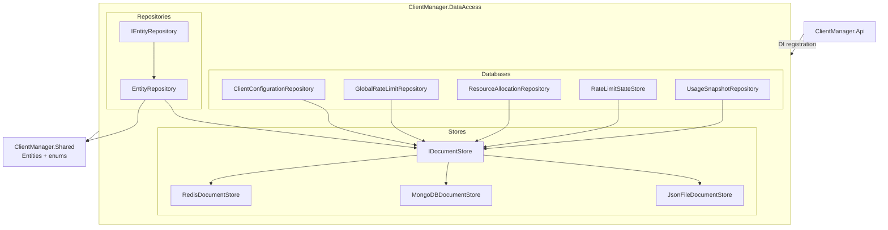

# ClientManager.DataAccess

`ClientManager.DataAccess` is the persistence layer for the solution. It hides the details of where data is stored and gives the rest of the application a consistent set of repositories and stores to work with.

The project is intentionally split into two concerns:

1. **Generic document storage** - a provider-agnostic abstraction for basic document and counter operations.
2. **Domain repositories** - higher-level APIs that expose the data shapes used by the ClientManager domain.

This project targets **.NET 9** and depends on `ClientManager.Shared` for the shared entities and enums used across the solution.

## What this project is for

The `DataAccess` project is responsible for reading and writing the data used by the application:

- client configuration documents
- service access settings nested inside client configuration documents
- global rate limit definitions
- resource pool quotas and allocations
- usage snapshots for reporting and statistics
- counter storage for rate limiting

The API and application services depend on these abstractions, not on MongoDB, Redis, or file storage directly. That keeps the rest of the codebase independent from the actual persistence provider.

## Project structure

### 1. `Stores`

This layer contains the lowest-level abstraction in the project.

- `Stores/Interfaces/IDocumentStore.cs`
- `Stores/Implementations/JsonFileDocumentStore.cs`
- `Stores/Implementations/MongoDBDocumentStore.cs`
- `Stores/Implementations/RedisDocumentStore.cs`

`IDocumentStore` defines simple CRUD-style operations for keyed documents plus counter operations. Each concrete implementation maps that same contract to a different backing store:

- **JSON file store**: intended for local development and simple single-instance deployments.
- **MongoDB store**: maps collections to MongoDB collections.
- **Redis store**: maps collections to Redis hashes and counters to native Redis keys.

### 2. `Repositories`

This layer provides a generic repository pattern over `IDocumentStore`.

- `Repositories/Interfaces/IEntityRepository.cs`
- `Repositories/Implementations/EntityRepository.cs`

`IEntityRepository<T>` is a simple CRUD repository for entities identified by a string key. `EntityRepository<T>` delegates all operations to `IDocumentStore` and only needs a collection name plus a function that extracts the entity ID.

### 3. `Databases`

This folder contains the domain-specific repositories that the application actually uses.

- `Databases/Interfaces/IClientConfigurationRepository.cs`
- `Databases/Interfaces/IGlobalRateLimitRepository.cs`
- `Databases/Interfaces/IResourceAllocationRepository.cs`
- `Databases/Interfaces/IRateLimitStateStore.cs`
- `Databases/Interfaces/IUsageSnapshotRepository.cs`
- `Databases/Implementations/ClientConfigurationRepository.cs`
- `Databases/Implementations/GlobalRateLimitRepository.cs`
- `Databases/Implementations/ResourceAllocationRepository.cs`
- `Databases/Implementations/RateLimitStateStore.cs`
- `Databases/Implementations/UsageSnapshotRepository.cs`

These repositories are thin by design:

- they load documents from the generic store
- they apply domain-specific filtering or sub-document updates
- they save the modified result back to storage

That makes the repository names read like the business concepts they represent, rather than the storage technology behind them.

## Data model overview

The repositories in this project work with the shared domain models in `ClientManager.Shared`:

- `ClientConfiguration` stores the root configuration for one client.
- `ServiceAccessSettings` stores per-service access rules inside a client configuration.
- `ResourcePoolSettings` stores per-pool quota settings.
- `GlobalRateLimit` stores a system-wide limit for either a service or a resource pool.
- `ResourceAllocation` stores a leased resource-pool slot that can expire.
- `UsageSnapshot` stores time-bucketed usage data for reporting and analytics.

Those models are named to reflect their role in the domain, not their persistence format. They are records because they are mostly data carriers.

## Word choice guide

The project uses specific words on purpose. The names are meant to communicate both domain meaning and storage behavior.

| Word or phrase | Why it is used |
| --- | --- |
| **DataAccess** | This project only concerns persistence and retrieval. It does not contain UI logic or request orchestration. |
| **Store** | A low-level, provider-specific persistence abstraction. `IDocumentStore` is about generic storage operations, not business rules. |
| **Repository** | A domain-focused API that works with a particular aggregate or concept, such as client configurations or usage snapshots. |
| **Document** | The data is stored as keyed documents in JSON, MongoDB, or Redis-backed structures. |
| **Counter** | A compact persistence shape used for rate limiting. Counters are separate from normal documents because they have different access patterns. |
| **Snapshot** | A usage snapshot is a point-in-time capture of usage buckets, not a live stream or event log. |
| **Allocation** | A resource allocation is a temporary lease or slot reservation held by a client. |
| **Target** | A global rate limit can apply to different kinds of things, so the code uses a neutral word that covers both services and resource pools. |
| **Granularity** | Usage is grouped by bucket size, so this word describes the time resolution of the stored data. |
| **Configuration** | `ClientConfiguration` is the root document for per-client settings, which is broader than a single flag or rule. |

## How the layers fit together

The flow is simple:

1. The API registers one `IDocumentStore` implementation based on configuration.
2. The repository layer is registered on top of that store.
3. Application services depend on repository interfaces, not on the store implementation.
4. The selected store determines whether data lives in JSON files, MongoDB, or Redis.

This keeps the rest of the solution insulated from storage changes.

## Mermaid diagram

## Notes on implementation style

- All public APIs are asynchronous and accept `CancellationToken`.
- The JSON store uses an in-memory cache and atomic file writes.
- The MongoDB and Redis implementations are thin adapters over their respective client libraries.
- Domain repositories prefer simple in-memory filtering for readability and to keep the storage layer generic.

## Related projects

- `ClientManager.Api` uses this project to register persistence and application services.
- `ClientManager.Shared` supplies the entities and enums used by the repositories.
