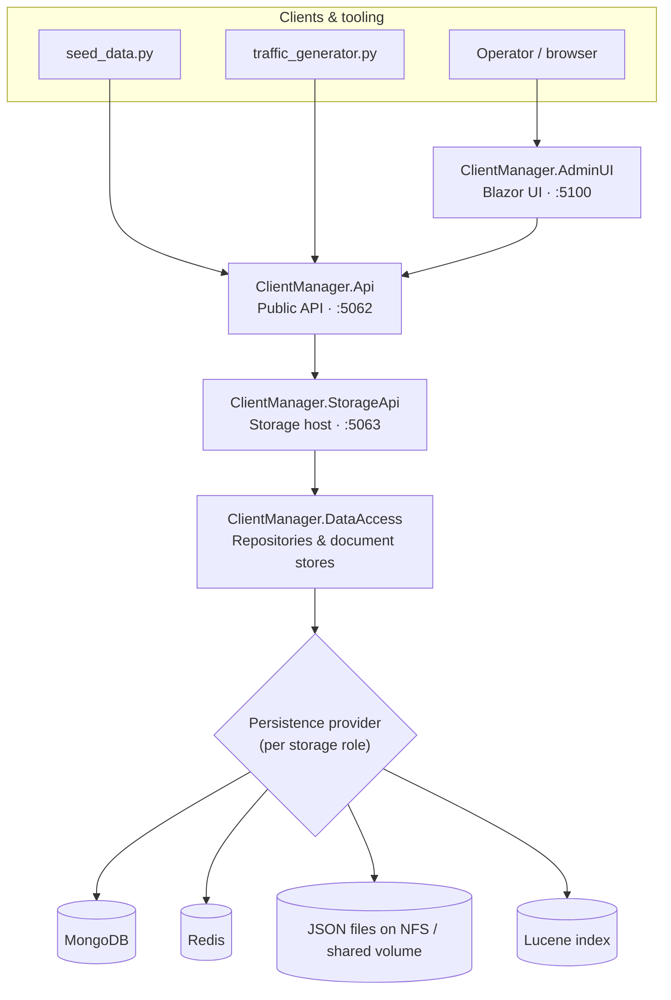

# ClientManager

ClientManager is a .NET-based sample application for managing clients, service configurations, resource pools, allocations, rate limits, and usage data. The solution is split into API, storage, data access, shared model, test, and administrative UI projects so each layer can be developed and hosted independently.

## Projects

- `ClientManager.AdminUI` provides the Blazor administrative interface.
- `ClientManager.Api` exposes the public application API.
- `ClientManager.StorageApi` owns persistence-facing API operations.
- `ClientManager.DataAccess` contains repository and storage abstractions.
- `ClientManager.Shared` contains shared models, configuration, logging, and concurrency helpers.
- `ClientManager.DataAccess.Tests` contains data access test coverage.

## Requirements

- .NET SDK 10.0 or later
- Python 3 for the optional helper scripts in `_scripts`

## Getting Started

Restore and build the solution:

```powershell
dotnet restore ClientManager.slnx
dotnet build ClientManager.slnx
```

Download the container images the repository uses for local development and for
production packaging and self-contained project distribution:

```powershell
python _scripts/download_images.py --download-dependencies
python _scripts/download_images.py --build-projects --build-version 1.0.1-alpha
```

Use `--list` to preview the exact pulls and builds without running Docker. The
`--download-dependencies` action downloads the external images used by the
project and exports them into `_scripts/.downloaded_images/`. The
`--build-projects` action builds flattened, version-tagged ClientManager images
so they can be published as standalone project images. Use `--build-version`
to control the project image tag and tar naming, `--dependency-image-override`
to point external dependency images at alternate registries, and
`--package-source` to use alternate NuGet feeds during the Dockerized restore.

For local manual testing, start the applications in this order:

1. `ClientManager.StorageApi`
2. `ClientManager.Api`
3. `ClientManager.AdminUI`

Then optionally seed demo data through the public API:

```powershell
python _scripts/seed_data.py --base-url http://localhost:5062
```

## Usage

### How the solution is orchestrated

ClientManager is a layered system. Operators and automated clients interact with
the public surfaces (the Admin UI and the public API), while all persistence is
funneled through a single storage host so that the data-access layer is never
referenced directly by user-facing projects.



Request flow:

1. The **Admin UI** (`:5100`) and external tooling call the **public API** (`:5062`).
2. The **public API** delegates all persistence operations to the **Storage API** (`:5063`).
3. The **Storage API** is the only host that references **DataAccess**, which maps each
   logical storage role onto a configured persistence provider.

> Start the hosts bottom-up — `StorageApi`, then `Api`, then `AdminUI` — because each
> layer depends on the one below it.

### Storage roles

DataAccess separates persistence into four independent **storage roles**, so a deployment
can mix backends (for example, Redis for hot rate-limit counters and MongoDB for durable
statistics):

| Role | Stores |
| --- | --- |
| `Configuration` | Client configurations, services, resource pools, and global rate limits. |
| `RateLimiting` | Rate-limit state counters (fixed window, sliding window, token bucket). |
| `Allocations` | Resource allocation documents and their atomic counters. |
| `Statistics` | Usage snapshot time-series data. |

Persistence is configured in the **Storage API** `appsettings.json` under the `Persistence`
section. Set `DefaultProvider` plus the matching `Default*` block for a uniform backend, or
add a `Roles` map to bind individual roles to different providers.

### Storage setups

Each provider is selected with `DefaultProvider` and configured with its matching options
block. The examples below are complete `Persistence` sections — drop one into the Storage API
`appsettings.json` (or supply the same keys as `Persistence__...` environment variables).

<table>
  <thead>
    <tr>
      <th>Backend</th>
      <th>Best for</th>
      <th>Configuration example</th>
    </tr>
  </thead>
  <tbody>
    <tr>
      <td><strong>MongoDB</strong></td>
      <td>Durable, distributed, multi-instance production deployments.</td>
      <td>

<pre><code>{
  "Persistence": {
    "DefaultProvider": "MongoDb",
    "DefaultMongoDb": {
      "ConnectionString": "mongodb://mongo:27017",
      "DatabaseName": "ClientManager",
      "UseTls": false
    }
  }
}</code></pre>

  </td>
    </tr>
    <tr>
      <td><strong>Redis</strong></td>
      <td>High-throughput, low-latency state where some durability trade-offs are acceptable.</td>
      <td>

<pre><code>{
  "Persistence": {
    "DefaultProvider": "Redis",
    "DefaultRedis": {
      "ConnectionString": "redis:6379",
      "UseTls": false,
      "ConnectTimeoutMilliseconds": 5000
    }
  }
}</code></pre>

  </td>
    </tr>
    <tr>
      <td><strong>NFS (shared JSON files)</strong></td>
      <td>Single-host or shared-volume deployments where a network file share backs the JSON store.</td>
      <td>

<pre><code>{
  "Persistence": {
    "DefaultProvider": "JsonFile",
    "DefaultJsonFile": {
      "DataDirectory": "/mnt/nfs/clientmanager/data",
      "PrettyPrint": true
    }
  }
}</code></pre>

  </td>
    </tr>
    <tr>
      <td><strong>Lucene</strong></td>
      <td>PVC-based single-host deployments needing full-text/field search without an external database.</td>
      <td>

<pre><code>{
  "Persistence": {
    "DefaultProvider": "Lucene",
    "DefaultLucene": {
      "IndexDirectory": "/data/lucene-index",
      "CommitIntervalSeconds": 1,
      "MaxBufferedDocs": 100
    }
  }
}</code></pre>

  </td>
    </tr>
  </tbody>
</table>

> `JsonFile` (including the NFS setup) and `Lucene` are file-backed and intended for local or
> single-host use. For multi-instance production, use a centralized backend such as MongoDB or Redis.

To mix providers per role, replace the single-provider block with a `Roles` map:

```json
{
  "Persistence": {
    "DefaultProvider": "MongoDb",
    "DefaultMongoDb": {
      "ConnectionString": "mongodb://mongo:27017",
      "DatabaseName": "ClientManager"
    },
    "Roles": {
      "RateLimiting": {
        "Provider": "Redis",
        "Redis": { "ConnectionString": "redis:6379" }
      }
    }
  }
}
```

## Repository Layout

```text
ClientManager.AdminUI/       Administrative UI
ClientManager.Api/           Public API host
ClientManager.StorageApi/    Storage API host
ClientManager.DataAccess/    Persistence layer
ClientManager.Shared/        Shared contracts and utilities
_scripts/                    Local development scripts
data/                        Local development data files
```

## License

This project is licensed under the GNU General Public License v3.0. See `LICENSE` for details.