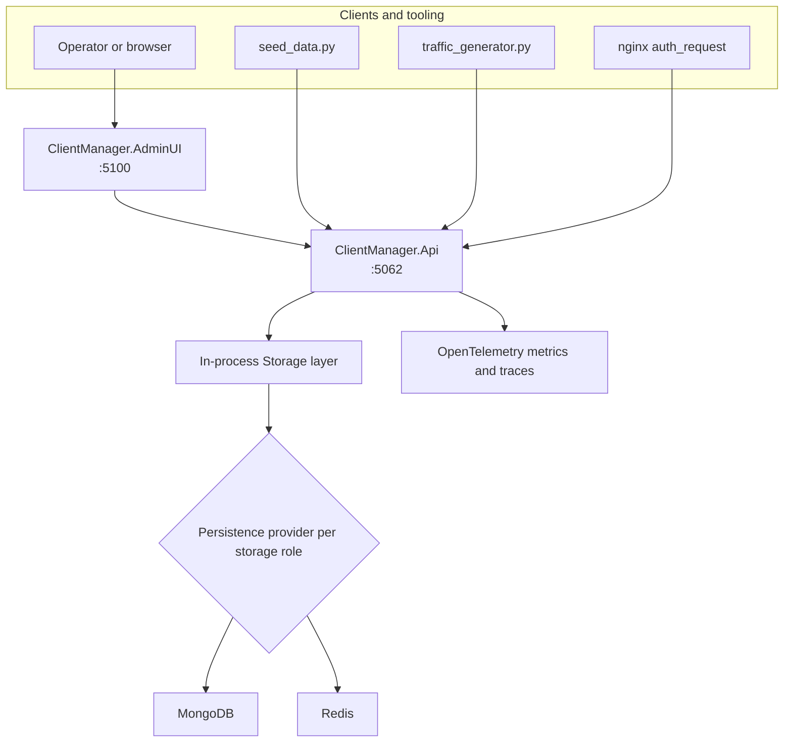

# ClientManager

Layered .NET application for managing clients, service access, global rate limits, and request RPM accounting.

### Public API, admin UI, and pluggable persistence backends (MongoDB and Redis).

- [Structure](#structure)
- [Architecture](#architecture)
- [Getting Started](#getting-started)
- [Persistence](#persistence)
- [Repository Layout](#repository-layout)
- [About](#about)
- [Additional Links](#additional-links)

# Structure

ClientManager is organized around separate hosts and a single persistence owner:

- `ClientManager.AdminUI` - Blazor administrative interface
- `ClientManager.Api` - public application API with in-process persistence (`ClientManager.Api/Storage`)
- `ClientManager.Shared` - shared models, configuration, logging, and helpers
- `tests/ClientManager.Tests` - unit and integration regression suite

This split keeps persistence logic behind the public API while still allowing the system to swap storage providers.

# Architecture

ClientManager is a layered system. Operators and tooling interact with the public surfaces, while all persistence runs in-process inside the API.



Request flow:

1. The Admin UI and helper scripts call `ClientManager.Api`.
2. `ClientManager.Api` owns persistence in-process under `ClientManager.Api/Storage`.
3. Each storage role (`Configuration`, `RateLimiting`, `Rpm`) routes to MongoDB or Redis per configuration.

# Getting Started

## Requirements

- .NET SDK 10.0 or later
- Python 3 for helper scripts in `_scripts`

## Build

```powershell
dotnet restore ClientManager.slnx
dotnet build ClientManager.slnx
```

## Local startup order

Start the applications bottom-up:

1. `ClientManager.Api`
2. `ClientManager.AdminUI`

Then optionally seed demo data:

```powershell
python _scripts/seed_data.py --base-url http://localhost:5062
```

To populate the dashboard with live traffic during testing:

```powershell
python _scripts/traffic_generator.py --base-url http://localhost:5062 --interval 2.0
```

Stop the traffic generator before stopping the API host.

## Container and image helpers

The repository includes a script for downloading dependency images and building project images:

```powershell
python _scripts/download_images.py --download-dependencies
python _scripts/download_images.py --build-projects --build-version 2.0.0
```

Use `--list` to preview actions without running Docker.

# Persistence

## Storage roles

Persistence is split into three logical roles:

| Role | Stores |
| --- | --- |
| `Configuration` | Client configurations, services, and global rate limits |
| `RateLimiting` | Runtime rate-limit counters |
| `Rpm` | Global second-bucket request ring for dashboard RPM |

This means the system routes storage by **role**, not by individual entity type or request.

## Provider model

The `Persistence` section in `ClientManager.Api/appsettings.json` supports:

- one `DefaultProvider` for the whole system
- optional per-role overrides under `Roles`

Supported providers:

| Provider | Best fit |
| --- | --- |
| `MongoDb` | Durable multi-instance shared state |
| `Redis` | Hot runtime state and counter-heavy roles (default) |

## Quick configuration examples

All MongoDB:

```json
{
  "Persistence": {
    "DefaultProvider": "MongoDb",
    "DefaultMongoDb": {
      "ConnectionString": "mongodb://mongo:27017",
      "DatabaseName": "ClientManager"
    }
  }
}
```

All Redis:

```json
{
  "Persistence": {
    "DefaultProvider": "Redis",
    "DefaultRedis": {
      "Host": "redis",
      "Port": 6379,
      "DatabaseIndex": 0,
      "useSsl": false
    }
  }
}
```

Redis for hot runtime state, MongoDB for configuration:

```json
{
  "Persistence": {
    "DefaultProvider": "MongoDb",
    "DefaultMongoDb": {
      "ConnectionString": "mongodb://mongo:27017",
      "DatabaseName": "ClientManager"
    },
    "Roles": {
      "RateLimiting": {
        "Provider": "Redis",
        "Redis": { "Host": "redis", "Port": 6379, "DatabaseIndex": 1, "useSsl": false }
      },
      "Rpm": {
        "Provider": "Redis",
        "Redis": { "Host": "redis", "Port": 6379, "DatabaseIndex": 2, "useSsl": false }
      }
    }
  }
}
```

For certificate-backed TLS/mTLS, set `UseTls` to `true`. See [docs/persistence/index.md](docs/persistence/index.md).

## Deployment guidance

- Prefer MongoDB or Redis for shared multi-instance deployments.
- Start Redis for local development: `docker compose -f compose/redis.yml up -d`

# Repository Layout

```text
ClientManager.AdminUI/       Administrative UI
ClientManager.Api/           Public API host and in-process storage
ClientManager.Shared/        Shared contracts and utilities
tests/ClientManager.Tests/   Regression tests
compose/                     Docker Compose stack definitions
_scripts/                    Local development scripts
docs/                        Project documentation
```

# About

ClientManager exists to separate public API concerns, operational tooling, and persistence concerns into explicit layers.

That split makes two things easier:

- the public API stays free of direct data-access references
- storage can be configured per logical role instead of forcing one backend choice for every workload

If documentation is unclear or missing, open an issue or update the docs in this repository. The persistence guide was added specifically to make the storage role model understandable without having to reverse-engineer the code.

# Documentation site

Guides live in [`docs/`](docs/) and can be built as a static site (Markdown, Mermaid diagrams, Material theme):

```powershell
pip install -r docs/requirements.txt
mkdocs serve    # live preview at http://127.0.0.1:8000
mkdocs build    # output in site/
```

Mermaid and fonts are bundled for offline/airgapped doc serving (vendored `docs/javascripts/mermaid.min.js`). Run `mkdocs build` before serving the static `site/` folder without internet access.

# Additional Links

- [Documentation home](docs/index.md) — build as a static site with `mkdocs serve`
- [Getting started](docs/getting-started.md) — first run, solution layout, seed data
- [Configuration reference](docs/configuration-reference.md) — appsettings and environment variables
- [Admin UI guide](docs/admin-ui-guide.md) — operator screens and workflows
- [API overview](docs/api-overview.md) — catalog, statistics, and runtime endpoints
- [Development and operations](docs/development-and-operations.md) — scripts, security, troubleshooting
- [Observability guides](docs/observability/index.md) — local stack, on-prem deploy, org Grafana/Prometheus
- [Integration guide](docs/integration-guide.md) — nginx example, client identification, propagating denials
- [Persistence overview](docs/persistence/index.md)
- [License](LICENSE)