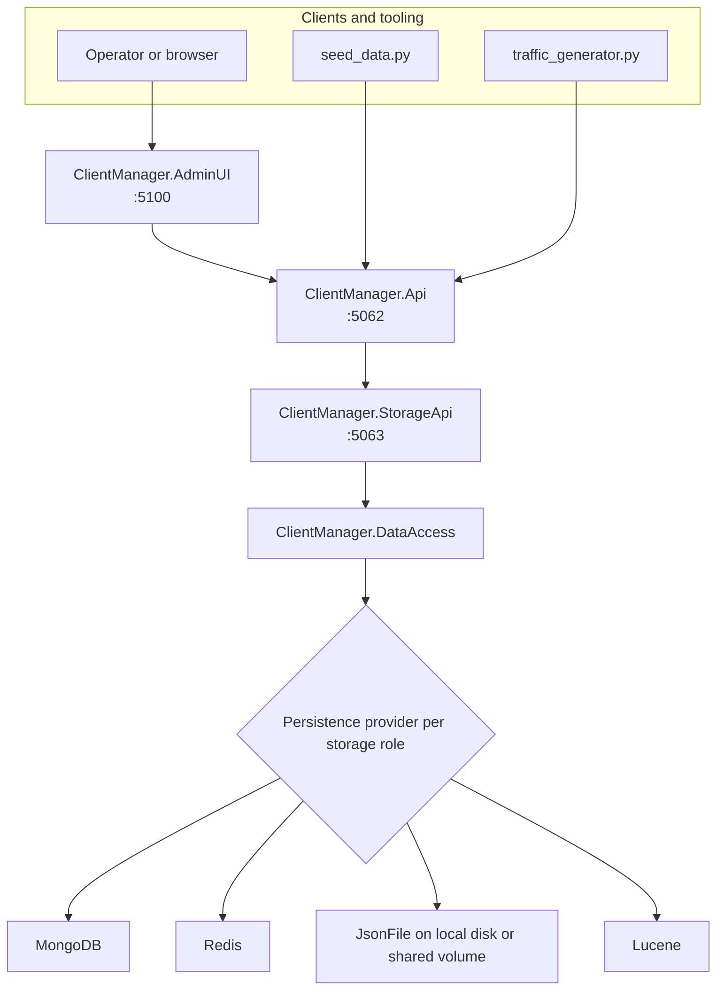

# ClientManager

Layered .NET application for managing clients, service access, resource pools, allocations, rate limits, and usage statistics.

### Public API, storage API, admin UI, and pluggable persistence backends.

- [Structure](#structure)
- [Architecture](#architecture)
- [Getting Started](#getting-started)
- [Persistence](#persistence)
- [Repository Layout](#repository-layout)
- [About](#about)
- [Additional Links](#additional-links)

# Structure

ClientManager is organized around separate hosts and a single persistence owner:

- `ClientManager.AdminUI` - Blazor administrative interface
- `ClientManager.Api` - public application API
- `ClientManager.StorageApi` - storage-facing API host and persistence owner
- `ClientManager.DataAccess` - repositories, databases, and document stores
- `ClientManager.Shared` - shared models, configuration, logging, and helpers
- `ClientManager.DataAccess.Tests` - data-access test coverage

This split keeps persistence logic out of the public API and the UI while still allowing the system to swap storage providers.

# Architecture

ClientManager is a layered system. Operators and tooling interact with the public surfaces, while all persistence is funneled through the Storage API.



Request flow:

1. The Admin UI and helper scripts call `ClientManager.Api`.
2. `ClientManager.Api` delegates persistence-facing work to `ClientManager.StorageApi`.
3. `ClientManager.StorageApi` is the only host that talks to `ClientManager.DataAccess`.
4. `ClientManager.DataAccess` routes each storage role to its configured backend.

# Getting Started

## Requirements

- .NET SDK 10.0 or later
- Python 3 for helper scripts in `_scripts`

## Build

```powershell
dotnet restore ClientManager.slnx
dotnet build ClientManager.slnx
```

## Local startup order

Start the applications bottom-up:

1. `ClientManager.StorageApi`
2. `ClientManager.Api`
3. `ClientManager.AdminUI`

Then optionally seed demo data:

```powershell
python _scripts/seed_data.py --base-url http://localhost:5062
```

To populate the dashboard with live traffic during testing:

```powershell
python _scripts/traffic_generator.py --base-url http://localhost:5062 --interval 2.0
```

Stop the traffic generator before stopping the API hosts.

## Container and image helpers

The repository includes a script for downloading dependency images and building project images:

```powershell
python _scripts/download_images.py --download-dependencies
python _scripts/download_images.py --build-projects --build-version 1.0.1-alpha
```

Use `--list` to preview actions without running Docker.

# Persistence

## Storage roles

Persistence is split into four logical roles:

| Role | Stores |
| --- | --- |
| `Configuration` | Client configurations, services, resource pools, and global rate limits |
| `RateLimiting` | Runtime rate-limit counters |
| `Allocations` | Resource allocation documents and allocation counters |
| `Statistics` | Usage snapshot time-series data |

This means the system routes storage by **role**, not by individual entity type or request.

## Provider model

The `Persistence` section in `ClientManager.StorageApi/appsettings.json` supports:

- one `DefaultProvider` for the whole system
- optional per-role overrides under `Roles`

Supported providers:

| Provider | Best fit |
| --- | --- |
| `MongoDb` | Durable multi-instance shared state |
| `Redis` | Hot runtime state and counter-heavy roles |
| `JsonFile` | Local or shared-volume file-backed storage |
| `Lucene` | File-backed indexed storage without an external database |

Important distinction:

- “NFS” is not a separate provider in this codebase
- using NFS means a file-backed provider such as `JsonFile` or `Lucene` writes to a mounted shared directory

## Quick configuration examples

All MongoDB:

```json
{
  "Persistence": {
    "DefaultProvider": "MongoDb",
    "DefaultMongoDb": {
      "ConnectionString": "mongodb://mongo:27017",
      "DatabaseName": "ClientManager"
    }
  }
}
```

All Redis:

```json
{
  "Persistence": {
    "DefaultProvider": "Redis",
    "DefaultRedis": {
      "ConnectionString": "redis:6379",
      "DatabaseIndex": 0
    }
  }
}
```

Redis for hot runtime state, MongoDB for the rest:

```json
{
  "Persistence": {
    "DefaultProvider": "MongoDb",
    "DefaultMongoDb": {
      "ConnectionString": "mongodb://mongo:27017",
      "DatabaseName": "ClientManager"
    },
    "Roles": {
      "RateLimiting": {
        "Provider": "Redis",
        "Redis": { "ConnectionString": "redis:6379", "DatabaseIndex": 1 }
      },
      "Allocations": {
        "Provider": "Redis",
        "Redis": { "ConnectionString": "redis:6379", "DatabaseIndex": 2 }
      }
    }
  }
}
```

Using different Redis `DatabaseIndex` values for different roles is supported. For a full explanation of what each backend actually stores, how all-Redis behaves, and how mixed Redis/Mongo or Redis/NFS splits behave, see [docs/persistence-guide.md](docs/persistence-guide.md).

## Deployment guidance

- Prefer MongoDB or Redis for shared multi-instance deployments.
- Treat `JsonFile` and `Lucene` as file-backed local or single-host oriented providers.
- If you use a shared NFS volume, you are still using a file-backed provider, not a dedicated NFS database provider.

# Repository Layout

```text
ClientManager.AdminUI/       Administrative UI
ClientManager.Api/           Public API host
ClientManager.StorageApi/    Storage API host
ClientManager.DataAccess/    Persistence layer
ClientManager.Shared/        Shared contracts and utilities
ClientManager.DataAccess.Tests/ Data-access tests
_scripts/                    Local development scripts
data/                        Local development data files
docs/                        Project documentation
```

# About

ClientManager exists to separate public API concerns, operational tooling, and persistence concerns into explicit layers.

That split makes two things easier:

- the public API stays free of direct data-access references
- storage can be configured per logical role instead of forcing one backend choice for every workload

If documentation is unclear or missing, open an issue or update the docs in this repository. The persistence guide was added specifically to make the storage split understandable without having to reverse-engineer the code.

# Additional Links

- [Persistence guide](docs/persistence-guide.md)
- [DataAccess notes](ClientManager.DataAccess/README.md)
- [License](LICENSE)