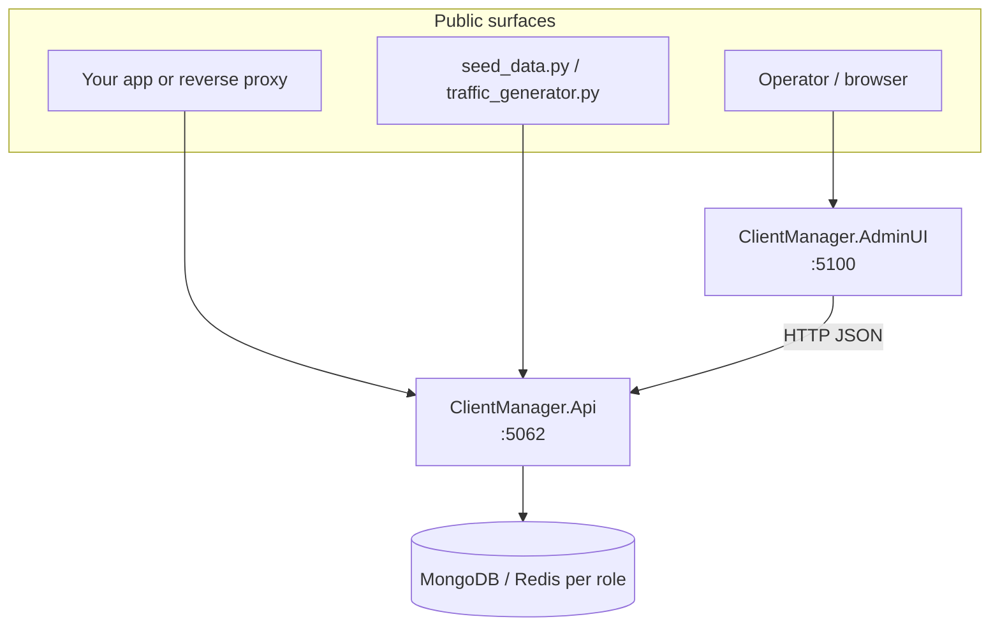

# Architecture overview

ClientManager is a layered .NET application that answers operational questions at request time: *may this client use this service?* and *is it under its rate limit?* This page explains how the solution is organized, which host owns what, and how data flows between components.

## Solution structure

The repository is split so persistence stays inside the API while operators get a dedicated admin experience.

| Project | Role |
| --- | --- |
| `ClientManager.Api` | Public HTTP API, business logic, in-process storage (`Storage/`), metrics export |
| `ClientManager.AdminUI` | Blazor Server admin dashboard; calls the API over HTTP only |
| `ClientManager.Shared` | Entities, DTOs, enums, configuration models, logging helpers |

**Local startup order:** start `ClientManager.Api` first, then `ClientManager.AdminUI`. The Admin UI reads `ApiBaseUrl` from configuration (default `http://localhost:5062`).

## API vs Admin UI

### ClientManager.Api

The API is the **single owner of business logic and persistence**:

- Access checks and rate-limit enforcement
- Catalog CRUD for clients, services, and global rate limits
- RPM accounting for the dashboard
- OpenTelemetry metrics at `/prometheus/otel`

Storage lives under `ClientManager.Api/Storage` (document stores, databases, repositories). No separate DataAccess project.

### ClientManager.AdminUI

The Admin UI is a **thin HTTP client** built with Blazor Server and Radzen components:

- Dashboard (three stat cards), entity list/editor pages
- Scoped API services (`ClientApiService`, `StatisticsApiService`, …) that map forms to Shared models

It never opens document stores directly. If the API is down, the UI cannot manage configuration or show live statistics.

!!! tip "Same API for operators and integrators"
    Integrators call the same REST surface the Admin UI uses for catalog and statistics. Runtime gatekeeping (`GET /api/v1/access/check`) is intended for your edge layer — see the [Integration guide](../integration-guide.md).

## Internal layering inside the API

| Layer | Examples | Purpose |
| --- | --- | --- |
| **Controllers** | `AccessCheckController`, `ServicesController` | HTTP routing (`api/v1/...`), request/response mapping |
| **Runtime services** | `AccessControlService`, `RateLimitService`, `RpmAccountingService` | Hot-path evaluation on every access check |
| **Catalog services** | `ServiceCatalogService`, `ClientConfigurationCatalogService` | CRUD with cache invalidation |
| **Read models** | `StatisticsService` | Dashboard overview (counts + RPM) |
| **Instrumentation** | `StorageMetrics`, `ClientManagerMetrics` | OpenTelemetry activities and Prometheus counters |

Registration is centralized in `StorageServicesRegistration.cs` and `ServiceCollectionExtensions.AddPublicApiServices()`.

## Persistence in one paragraph

Configuration, rate-limit counters, and RPM second-buckets are routed through three **storage roles** (`Configuration`, `RateLimiting`, `Rpm`). Each role binds independently to MongoDB or Redis at startup.

See the [Persistence overview](../persistence/index.md). Persistence is **role-based**: if the `RateLimiting` role points at Redis, every rate-limit counter uses Redis.

## Service registration pattern

The API builds upward from keyed `IDocumentStore` instances:

1. **Keyed document stores** — one store per `StorageRole`
2. **Domain databases** — e.g. `ClientConfigurationDatabase`, `RateLimitStateDatabase`, `RpmRingDatabase`
3. **Entity repositories** — generic `IEntityRepository<T>` over named collections
4. **Instrumented wrapper** — metrics and traces on store operations

Catalog services invalidate `IStorageReadCache` after writes so hot-path reads stay fast.

## Observability endpoints

| Endpoint | Purpose |
| --- | --- |
| `/docs` | Swagger UI |
| `/prometheus/otel` | OpenTelemetry runtime metrics (Prometheus scrape) |
| `/api/v1/statistics/overview` | Client count, service count, current RPM |

Hot-path operations (`storage.access.check`) emit trace spans tagged with `client.id` and `service.id`.

For Prometheus, Grafana, Jaeger, and OTLP setup, see the [Metrics integration guide](../metrics-integration-guide.md).

## Related reading

- [Domain model](domain-model.md) — clients, services, and rate-limit configuration
- [Request flow](request-flow.md) — access-check pipeline
- [Usage and observability](usage-and-observability.md) — RPM accounting and metrics
- [Integration guide](../integration-guide.md) — wire ClientManager in front of your services
- [Persistence overview](../persistence/index.md) — configure MongoDB/Redis per role
