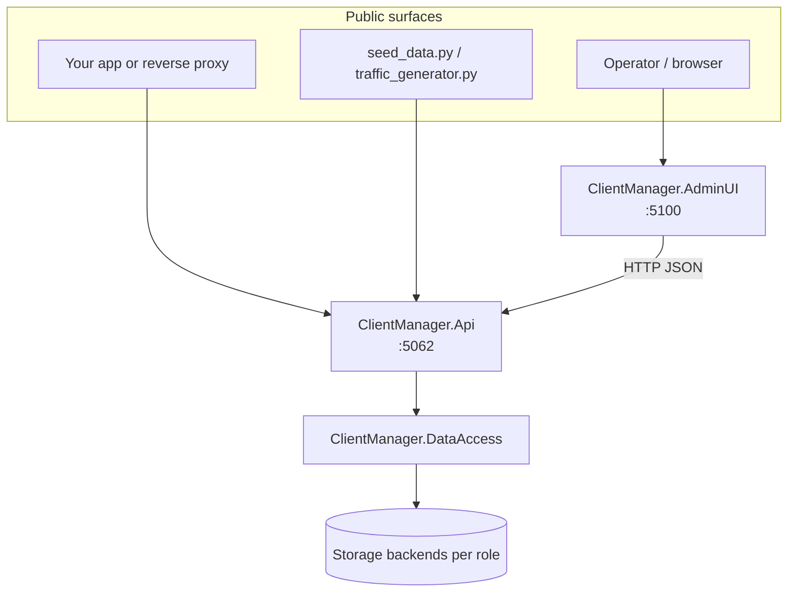

# Architecture overview

ClientManager is a layered .NET application that answers operational questions at request time: *may this client use this service?*, *is it under its rate limit?*, and *can it hold a slot in a resource pool?* This page explains how the solution is organized, which host owns what, and how data flows between components.

## Solution structure

The repository is split into separate projects so persistence stays behind the API while operators still get a dedicated admin experience.

| Project | Role |
| --- | --- |
| `ClientManager.Api` | Public HTTP API, all business logic, in-process persistence, background workers, metrics export |
| `ClientManager.AdminUI` | Blazor Server admin dashboard; calls the API over HTTP only |
| `ClientManager.DataAccess` | Document stores, databases, and repositories (referenced **only** by the API) |
| `ClientManager.Shared` | Entities, DTOs, enums, configuration models, logging helpers |

**Local startup order:** start `ClientManager.Api` first, then `ClientManager.AdminUI`. The Admin UI reads `ApiBaseUrl` from configuration (default `http://localhost:5062`).

## API vs Admin UI

These two hosts have deliberately different responsibilities.

### ClientManager.Api

The API is the **single owner of business logic and persistence**. Everything that mutates or evaluates runtime state runs here:

- Access checks and rate-limit enforcement
- Resource pool acquire / release
- Catalog CRUD for clients, services, pools, and global limits
- Usage recording and statistics queries
- Background cleanup (expired allocations) and usage snapshot persistence

`ClientManager.DataAccess` is registered **in-process** inside the API (`AddInProcessStorageServices`). No other project talks to document stores directly.

### ClientManager.AdminUI

The Admin UI is a **thin HTTP client** built with Blazor Server and Radzen components. It provides:

- Dashboard, monitor, and entity editor pages
- Scoped API services (`ClientApiService`, `StatisticsApiService`, …) that map forms to Shared models

It never references `ClientManager.DataAccess`. If the API is down, the UI cannot manage configuration or show live statistics.

!!! tip "Same API for operators and integrators"
    Integrators call the same REST surface the Admin UI uses for catalog and statistics endpoints. Runtime gatekeeping endpoints (`/access/check`, `/resources/acquire`) are intended for your edge layer or application middleware — see the [Integration guide](../integration-guide.md).

## Internal layering inside the API

Within `ClientManager.Api`, code is grouped by concern:

| Layer | Examples | Purpose |
| --- | --- | --- |
| **Controllers** | `AccessCheckController`, `ServicesController` | HTTP routing, request/response mapping |
| **Runtime services** | `AccessControlService`, `ResourceAllocationService`, `RateLimitService` | Hot-path evaluation on every gatekeeping call |
| **Catalog services** | `ServiceCatalogService`, `ClientConfigurationCatalogService` | CRUD for configuration documents with cache invalidation |
| **Read models** | `StatisticsService`, `UsageStatisticsService` | Aggregated views for dashboards and export |
| **Background workers** | `AllocationCleanupService`, `UsagePersistenceService` | Reconcile counters, flush usage buffers, optional seeding |
| **Instrumentation** | `StorageMetrics`, `StorageHotPathTrace` | OpenTelemetry activities and Prometheus counters |

Registration is centralized in `StorageServicesRegistration.cs`. The split between `AddPublicApiServices()` (logging + statistics facade) and `AddInProcessStorageServices()` (everything else) is intentional: it keeps the public read surface small while the storage domain stays cohesive.

## Persistence in one paragraph

Configuration, rate-limit counters, allocation documents, and usage snapshots are routed through four **storage roles** (`Configuration`, `RateLimiting`, `Allocations`, `Statistics`). Each role binds independently to JsonFile, MongoDB, Redis, or Lucene at startup.

That model is documented in depth in the [Persistence overview](../persistence/index.md). The key architectural point here: **persistence is role-based, not entity-by-entity**. If the `RateLimiting` role points at Redis, every rate-limit counter uses Redis.

## Service registration pattern

`ClientManager.DataAccess` exposes `IDocumentStore` — the lowest-level abstraction for document CRUD and atomic counters. The API builds upward:

1. **Keyed document stores** — one `IDocumentStore` instance per `StorageRole`
2. **Domain databases** — e.g. `ClientConfigurationDatabase`, `RateLimitStateDatabase`
3. **Entity repositories** — generic `IEntityRepository<T>` over named collections
4. **Instrumented wrapper** — `InstrumentedDocumentStore` adds metrics and traces

Catalog services sit on repositories and invalidate `IStorageReadCache` after writes so hot-path reads stay fast without serving stale configuration.

## Background workers

Two long-running services keep runtime state consistent without blocking request threads:

| Worker | Interval | Responsibility |
| --- | --- | --- |
| `AllocationCleanupService` | ~30 seconds | Reclaim expired allocations, reconcile slot counters |
| `UsagePersistenceService` | Fast + slow flush loops | Move in-memory usage events from `UsageBuffer` into durable `UsageSnapshot` documents |

Expired allocation cleanup **does not** emit a `Released` usage event. Integrators should release slots explicitly when work completes.

## Observability endpoints

| Endpoint | Purpose |
| --- | --- |
| `/docs` | Swagger UI (development) |
| `/prometheus/otel` | OpenTelemetry runtime metrics (Prometheus scrape) |
| `/api/v1/statistics/*` | System overview, per-entity usage, catalog summaries |
| `/api/v1/metrics/*` | Usage/capacity gauges for external monitoring |

Hot-path operations (`storage.access.check`, `storage.resource.acquire`) emit trace spans tagged with `client.id`, `service.id`, or `resource_pool.id` for correlation with API logs and problem responses.

For Prometheus, Grafana, Jaeger, and OTLP setup, see the [Metrics integration guide](../metrics-integration-guide.md).

## How this doc site maps to files

This documentation site is built with [MkDocs](https://www.mkdocs.org/) and the Material theme. Understanding the mapping helps when adding pages:

| Filesystem | Site URL | Navigation |
| --- | --- | --- |
| `docs/index.md` | `/` | Defined in `nav` → **Home** |
| `docs/integration-guide.md` | `/integration-guide/` | Top-level nav item |
| `docs/core/architecture.md` | `/core/architecture/` | Nested under **Core concepts** |

- **File path → URL:** `docs/foo/bar.md` becomes `/foo/bar/` on the built site.
- **Sidebar order and nesting** come from the `nav` section in `mkdocs.yml` at the repository root — not from folder structure alone. A markdown file can exist without a nav entry, but it will not appear in the sidebar unless linked from another page.
- **Build locally:** `pip install -r docs/requirements.txt` then `mkdocs serve` (see [Home](../index.md)).

## Related reading

- [Domain model](domain-model.md) — clients, services, pools, and rate-limit configuration
- [Request flow](request-flow.md) — what happens on access checks and resource acquisition
- [Usage and observability](usage-and-observability.md) — how events become dashboard data
- [Integration guide](../integration-guide.md) — wire ClientManager in front of your services
- [Persistence overview](../persistence/index.md) — configure storage backends per role
