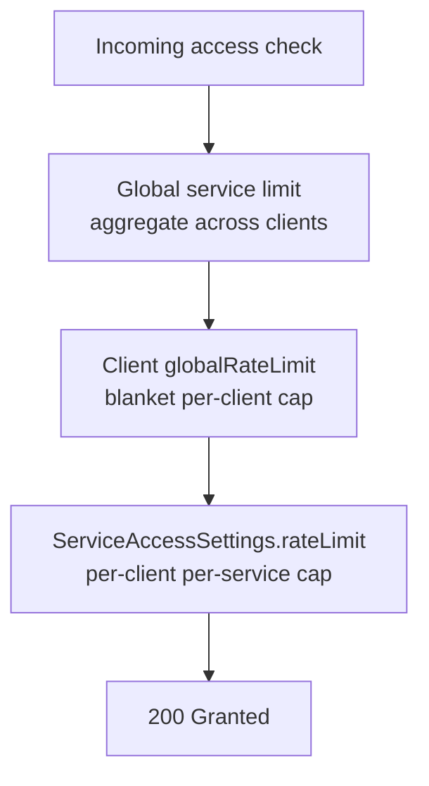
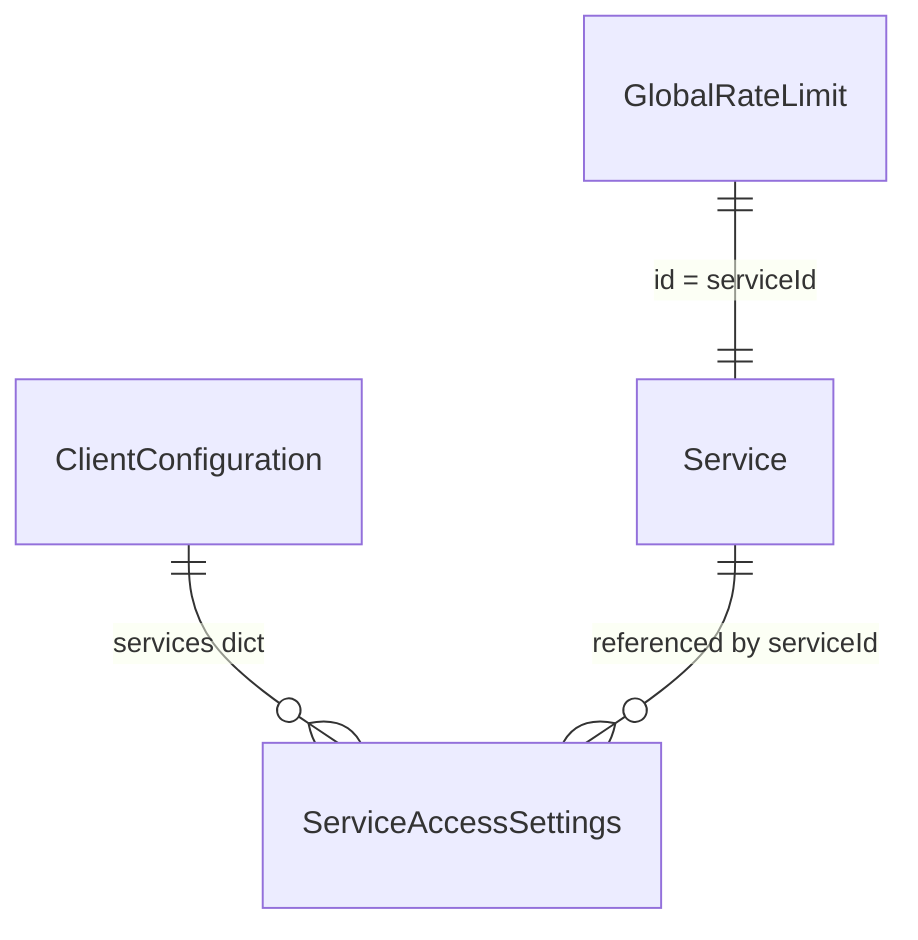

# Domain model

ClientManager's configuration revolves around clients, services, and rate limits. Understanding how they relate — and which settings override which — is essential before tuning limits or debugging denials.

## Clients (`ClientConfiguration`)

A **client** is any caller you identify at the edge — a mobile app, tenant, partner integration, internal batch job. Each client has one `ClientConfiguration` document keyed by `clientId`.

### Deny-by-default access

A client reaches a service only when **all** of the following are true:

1. The client document exists and `isEnabled` is `true`
2. The target service exists and `isEnabled` is `true`
3. The client's `services` dictionary contains an entry for that `serviceId`
4. That entry's `isAllowed` is `true`

Missing configuration is **`401 Unauthorized`**. Explicit denial or disabled flags are **`403 Forbidden`**.

!!! note "ClientManager is not a user directory"
    `clientId` is an operational identifier **you** supply on every request. ClientManager does not authenticate end users, issue tokens, or map LDAP groups.

### Per-service settings (`ServiceAccessSettings`)

Each entry in `services[serviceId]` can carry:

| Field | Purpose |
| --- | --- |
| `isAllowed` | Whether this client may call the service at all |
| `rateLimit` | Optional per-client-per-service throttle (evaluated **in addition to** client-wide limits) |
| `contributesToGlobalLimit` | Override: whether this client's requests count toward the shared global service counter |
| `exemptFromGlobalLimit` | Override: whether this client skips global service denials when the counter is exhausted |

When a per-service override is `null`, the client-level default applies.

### Client-wide rate limit (`globalRateLimit`)

`ClientConfiguration.globalRateLimit` throttles a single client **across all services**. It is separate from per-service limits; both can apply to the same request.

### Global limit participation flags

| Flag | Effect |
| --- | --- |
| `contributesToGlobalLimits` | When `true`, this client's traffic increments shared global counters |
| `exemptFromGlobalLimits` | When `true`, this client is never denied by exhausted global counters |

Per-service overrides win over the client defaults when set.

## Services (`Service`)

A **service** is a named capability you protect — `pdf-render`, `billing-api`, `search`:

- `id` — stable identifier sent as `serviceId` on access checks
- `name` — display label in the Admin UI
- `isEnabled` — when `false`, every access check fails with 403

Services do not embed rate limits. Limits live on the client configuration, on global rules, or both.

## Global rate limits (`GlobalRateLimit`)

**Global** limits protect a **service** from aggregate overload across all contributing clients.

| Field | Meaning |
| --- | --- |
| `id` | **Service identifier** — also the document ID (one global limit per service) |
| `policy` | `RateLimitPolicy`: `strategy`, `maxRequests`, `window`, optional `tokensPerRefill` |

There is no `targetType` field; the document ID is always the service ID.

### Three layers of rate limiting

A single access check can encounter up to three limit evaluations:

## Rate limit strategies

All rate limits use the same strategy enum:

| Strategy | Behavior | Trade-off |
| --- | --- | --- |
| **FixedWindow** | Count requests in non-overlapping time buckets | Simple and fast; can allow bursts at window edges |
| **ApproximateSlidingWindow** | Blend previous and current window counts proportionally | Smoother than fixed windows |
| **TokenBucket** | Tokens refill at a steady rate; requests consume tokens | Allows controlled bursts while enforcing average rate |

Denied rate-limit responses include a `Retry-After` header when the active strategy can compute one.

## Configuration vs runtime state

| Category | Examples | Storage role |
| --- | --- | --- |
| **Configuration** | Clients, services, global limit rules | `Configuration` |
| **Runtime counters** | Rate-limit algorithm state | `RateLimiting` |
| **RPM buckets** | Second-bucket ring for dashboard RPM | `Rpm` |

Operators edit configuration through the Admin UI or catalog API. Runtime state is created and updated automatically on access checks.

## Entity relationship summary

## Related reading

- [Request flow](request-flow.md) — ordered pipeline for access checks
- [Usage and observability](usage-and-observability.md) — RPM and metrics
- [Integration guide](../integration-guide.md) — HTTP status codes
- [Persistence overview](../persistence/index.md) — where each category is stored
