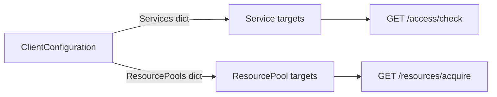
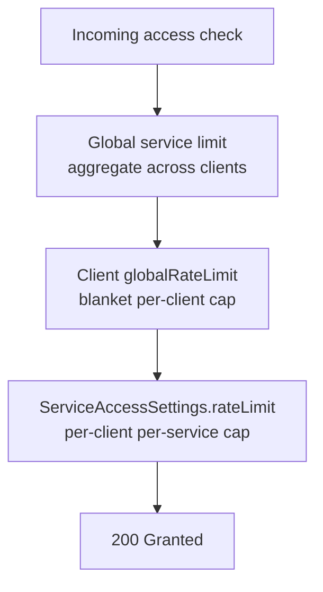
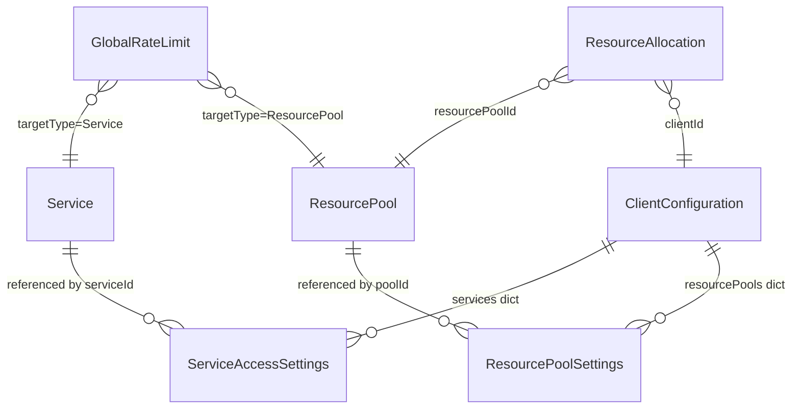

# Domain model

ClientManager's configuration revolves around a small set of entities. Understanding how they relate — and which settings override which — is essential before tuning limits or debugging denials.

## Two kinds of targets

Everything the system protects falls into one of two categories:

| Target type | Examples | Governed by |
| --- | --- | --- |
| **Service** | REST API, microservice, serverless function | Access allow-list + rate limits (request frequency) |
| **Resource pool** | DB connection pool, GPU slot, message broker partition | Slot quotas (concurrency) + optional acquisition rate limits |

Services are **stateless**: each request is independent. Resource pools are **stateful**: a client **acquires** a slot, holds it while work runs, then **releases** it (or loses it when TTL expires).



## Clients (`ClientConfiguration`)

A **client** is any caller you identify at the edge — a mobile app, tenant, partner integration, internal batch job. Each client has one `ClientConfiguration` document keyed by `clientId`.

### Deny-by-default access

A client reaches a service only when **all** of the following are true:

1. The client document exists and `isEnabled` is `true`
2. The target service exists and `isEnabled` is `true`
3. The client's `services` dictionary contains an entry for that `serviceId`
4. That entry's `isAllowed` is `true`

Missing configuration is **`401 Unauthorized`**. Explicit denial or disabled flags are **`403 Forbidden`**.

!!! note "ClientManager is not a user directory"
    `clientId` is an operational identifier **you** supply on every request. ClientManager does not authenticate end users, issue tokens, or map LDAP groups. Your edge layer is responsible for deriving a stable `clientId` from headers, API keys, or JWT claims.

### Per-service settings (`ServiceAccessSettings`)

Each entry in `services[serviceId]` can carry:

| Field | Purpose |
| --- | --- |
| `isAllowed` | Whether this client may call the service at all |
| `rateLimit` | Optional per-client-per-service throttle (evaluated **in addition to** client-wide limits) |
| `contributesToGlobalLimit` | Override: whether this client's requests count toward the shared global service counter |
| `exemptFromGlobalLimit` | Override: whether this client skips global service denials when the counter is exhausted |

When a per-service override is `null`, the client-level default applies.

### Client-wide rate limit (`globalRateLimit`)

`ClientConfiguration.globalRateLimit` throttles a single client **across all services** — a blanket cap on total request volume. It is separate from per-service limits; both can apply to the same request.

### Resource pool quotas (`resourcePools`)

Entries in `resourcePools[poolId]` set **per-client concurrency caps**:

```json
"resourcePools": {
  "pdf-render-slots": { "maxSlots": 3 }
}
```

This limits how many active allocations **this client** may hold. It does **not** grant access by itself — acquisition still requires a valid pool and available capacity.

If no entry exists for a pool, the client has no individual cap (only the pool's system-wide `maxSlots` applies).

### Global limit participation flags

Two client-level booleans control how the client interacts with **global** rate limits (see below):

| Flag | Effect |
| --- | --- |
| `contributesToGlobalLimits` | When `true`, this client's traffic increments shared global counters |
| `exemptFromGlobalLimits` | When `true`, this client is never denied by exhausted global counters |

Per-service overrides (`contributesToGlobalLimit`, `exemptFromGlobalLimit`) win over the client defaults when set.

These flags are **orthogonal**: a client can contribute without being exempt, be exempt without contributing, both, or neither.

## Services (`Service`)

A **service** is a named capability you protect — `pdf-render`, `billing-api`, `search`. Services are lightweight catalog entries:

- `id` — stable identifier sent as `serviceId` on access checks
- `name` — display label in the Admin UI
- `isEnabled` — when `false`, every access check fails with 403 regardless of client configuration

Services do not embed rate limits. Limits live on the client configuration, on global rules, or both.

## Resource pools (`ResourcePool`)

A **resource pool** represents finite, holdable capacity:

| Field | Meaning |
| --- | --- |
| `maxSlots` | System-wide maximum concurrent allocations across all clients |
| `allocationTtl` | How long an unreleased slot lives before background cleanup reclaims it |

Acquisition checks **three** capacity layers in order:

1. Per-client slot cap (`ClientConfiguration.resourcePools`)
2. Global acquisition rate limit (if configured for this pool)
3. Pool-wide `maxSlots` vs current active count

## Global rate limits (`GlobalRateLimit`)

**Global** limits protect a **target** (service or resource pool) from aggregate overload. They throttle the combined traffic of all contributing clients — even when each client is individually within its own limits.

| Field | Meaning |
| --- | --- |
| `targetType` | `Service` or `ResourcePool` |
| `targetId` | Which service or pool the rule applies to |
| `strategy` | `FixedWindow`, `ApproximateSlidingWindow`, or `TokenBucket` |
| `limit` / `window` | Threshold and time window for the chosen strategy |

For **services**, global limits cap total request throughput (e.g. "10,000 requests/minute across all tenants"). For **resource pools**, they cap how fast slots can be acquired — independent of how many slots exist.

### Three layers of rate limiting

A single service access check can encounter up to three limit evaluations:



Resource acquisition adds global **pool** limits and slot quotas before the pool capacity check.

## Rate limit strategies

All rate limits — client, per-service, and global — use the same strategy enum:

| Strategy | Behavior | Trade-off |
| --- | --- | --- |
| **FixedWindow** | Count requests in non-overlapping time buckets; reset at window boundary | Simple and fast; can allow bursts at window edges |
| **ApproximateSlidingWindow** | Blend previous and current window counts proportionally | Smoother than fixed windows; slight over/under-count near boundaries |
| **TokenBucket** | Tokens refill at a steady rate; requests consume tokens | Allows controlled bursts while enforcing average rate |

Denied rate-limit responses include a `Retry-After` header when the active strategy can compute one.

## Allocations (`ResourceAllocation`)

An **allocation** is a held slot. Created on successful acquire:

- `allocationId` — returned to the caller; required for release
- `expiresAt` — derived from the pool's `allocationTtl`

Callers should release in a `finally` block. If a process crashes, `AllocationCleanupService` eventually reclaims the slot but does not record a `Released` usage event.

## Configuration vs runtime state

Not everything is a catalog document. The system distinguishes:

| Category | Examples | Typical backend role |
| --- | --- | --- |
| **Configuration** | Clients, services, pools, global limit rules | `Configuration` |
| **Runtime counters** | Rate-limit algorithm state | `RateLimiting` |
| **Runtime documents** | Active allocations, slot counters | `Allocations` |
| **Analytics** | Usage snapshot time series | `Statistics` |

Operators edit configuration through the Admin UI or catalog API. Runtime state is created and updated automatically on access checks and acquisitions.

## Entity relationship summary



## Related reading

- [Request flow](request-flow.md) — ordered pipeline for access checks and acquisitions
- [Usage and observability](usage-and-observability.md) — what gets recorded when access is granted or denied
- [Integration guide](../integration-guide.md) — HTTP status codes and integration checklist
- [Persistence overview](../persistence/index.md) — where each category is stored
