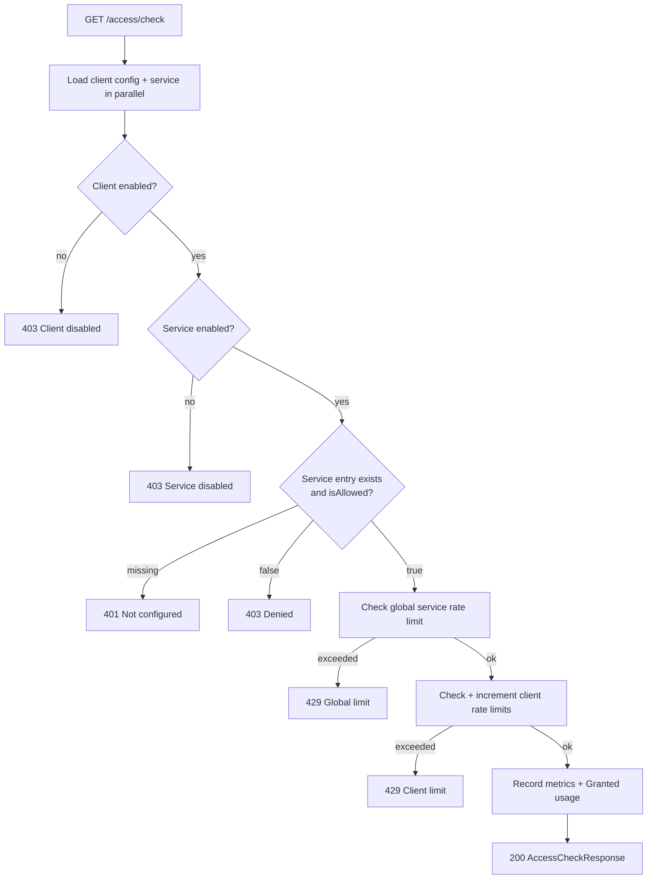
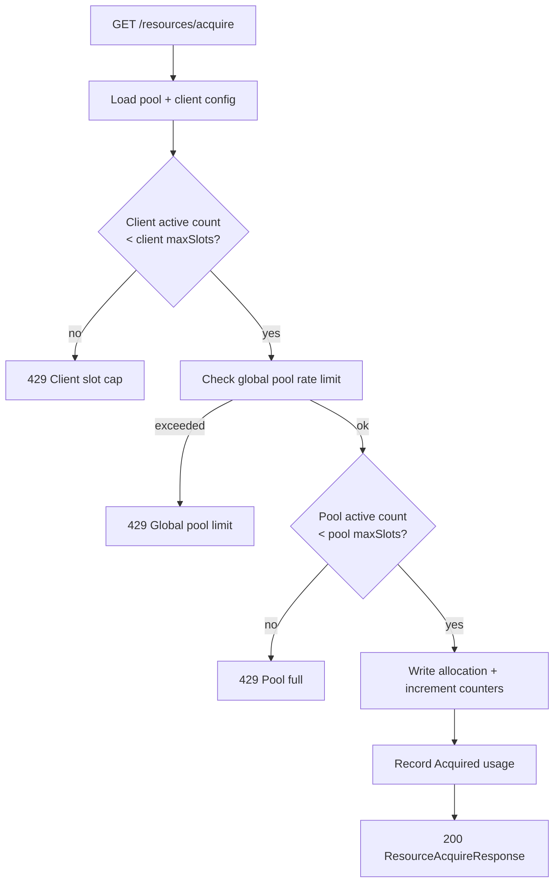
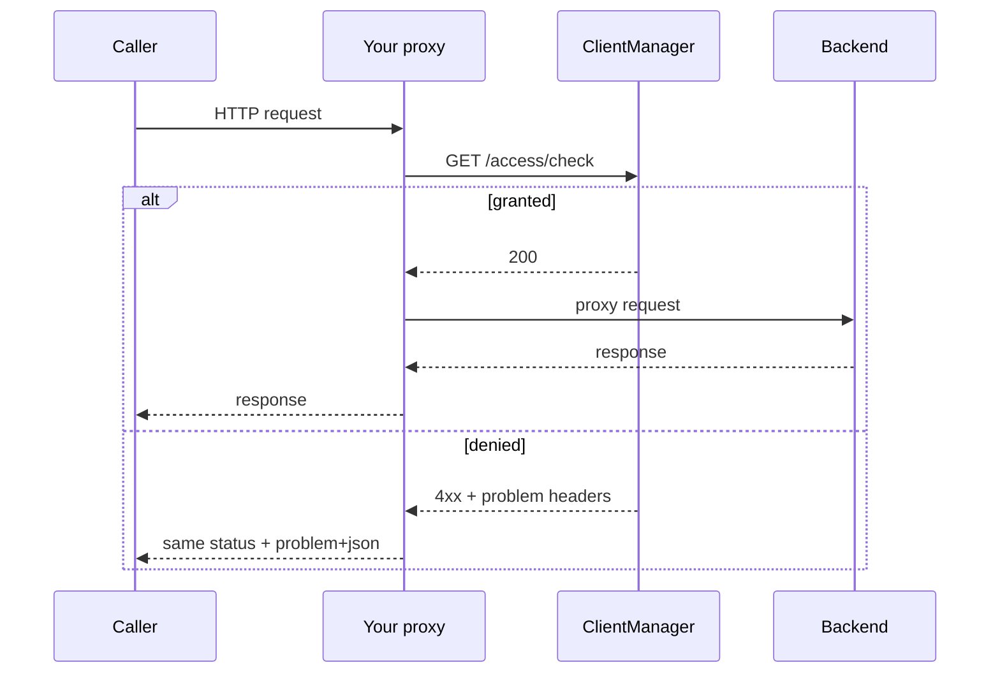
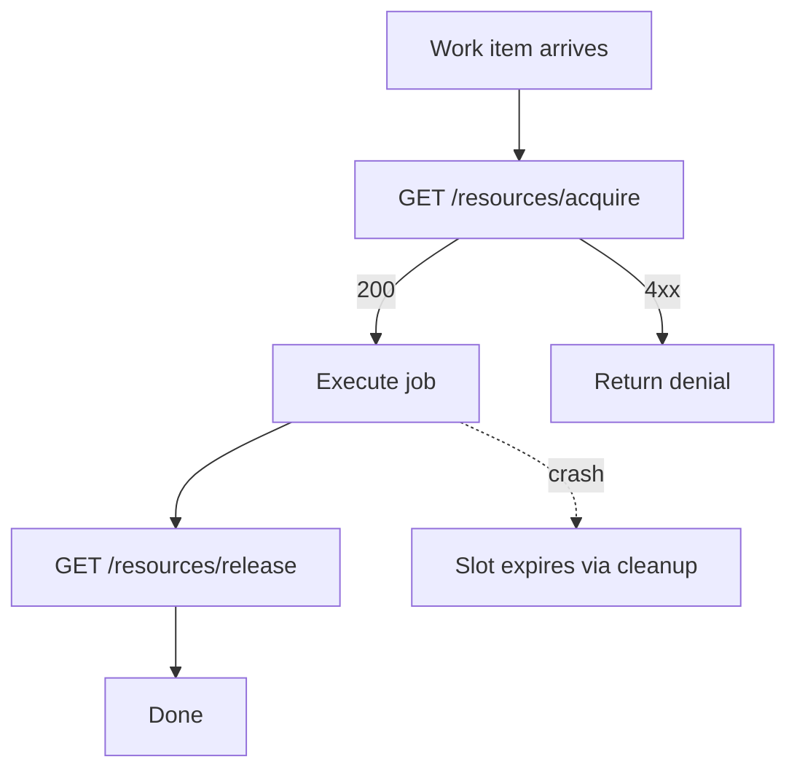

# Request flow

This page walks through what ClientManager does on the hot path — the code paths your reverse proxy or application calls on every inbound request. For configuration concepts, see the [Domain model](domain-model.md) first.

## API surface at a glance

| Operation | Method | Path | Side effects |
| --- | --- | --- | --- |
| Check access | `GET` | `/api/v1/access/check` | Increments rate limits; records `Granted` or `Denied` usage |
| Client accessibility report | `GET` | `/api/v1/access/{clientId}` | Read-only peek; safe for dashboards |
| Acquire slot | `GET` | `/api/v1/resources/acquire` | Creates allocation; increments counters |
| Release slot | `GET` | `/api/v1/resources/release` | Frees allocation; decrements counters |

All failures return [RFC 7807](https://datatracker.ietf.org/doc/html/rfc7807) `application/problem+json` with a `traceId` you can correlate to API logs. The same payload is echoed in `X-Problem-*` response headers for edge proxies — see the [Integration guide](../integration-guide.md).

## Service access check

`GET /api/v1/access/check` accepts query parameters `clientId` and `serviceId`:

```
GET /api/v1/access/check?clientId=mobile-app&serviceId=pdf-render
```

On success:

```json
{
  "clientId": "mobile-app",
  "serviceId": "pdf-render",
  "remainingRequests": 37
}
```

`remainingRequests` reflects the tightest applicable client-side limit when the strategy exposes headroom.

### Pipeline order

`AccessControlService` evaluates gates in a fixed sequence. The first failure short-circuits with an HTTP error:



**Important:** this endpoint is not a free "peek". A successful check **consumes quota** the same way serving the downstream request would. Use `GET /api/v1/access/{clientId}` when you need a monitoring view without incrementing counters.

### HTTP status mapping

| Status | Typical cause |
| --- | --- |
| `400` | Unknown `clientId` |
| `401` | No `services[serviceId]` entry on the client configuration |
| `403` | Client disabled, service disabled, or `isAllowed: false` |
| `404` | Unknown `serviceId` |
| `429` | Global service limit or client rate limit exceeded |
| `503` | Storage backend unreachable |

### Global limit evaluation on access checks

Before client-specific limits run, the service checks whether a `GlobalRateLimit` exists for this `serviceId`:

- Clients with `exemptFromGlobalLimit` (or service-level override) skip the denial even when the counter is exhausted
- Clients with `contributesToGlobalLimit` disabled do not increment the shared counter
- Everyone else increments and can be denied when the aggregate limit is hit

This protects the downstream service from total overload even when every tenant is within its own per-client cap.

### Client rate limit evaluation

`RateLimitService.CheckAndIncrementAsync` evaluates, in order:

1. Client-wide `globalRateLimit` (if configured)
2. Per-service `ServiceAccessSettings.rateLimit` (if configured)

Both use the configured strategy (`FixedWindow`, `ApproximateSlidingWindow`, or `TokenBucket`) against counter state in the `RateLimiting` storage role.

## Read-only accessibility report

`GET /api/v1/access/{clientId}` returns a report across **all registered services** — whether each would be allowed right now and whether rate limits are currently blocking access.

Use this from the Admin UI monitor page and operational dashboards. Because it does not increment counters, calling it in a tight poll loop will not drain a client's quota.

## Resource acquisition

`GET /api/v1/resources/acquire` accepts query parameters `clientId` and `resourcePoolId`:

```
GET /api/v1/resources/acquire?clientId=mobile-app&resourcePoolId=pdf-render-slots
```

On success:

```json
{
  "allocationId": "alloc-abc123",
  "expiresAt": "2026-06-07T14:32:00Z"
}
```

### Pipeline order

`ResourceAllocationService` applies constraints before writing an allocation document:



Unlike access checks, acquisition does **not** walk the service allow-list. Pool access is governed by slot quotas and rate limits, not `ClientConfiguration.services`.

### Release

`GET /api/v1/resources/release` accepts query parameter `allocationId`. A successful release:

- Marks the allocation as released
- Decrements client and pool active counters
- Records an `Acquired` → `Released` usage transition

Unknown or already-released allocation IDs return `404`.

### TTL and cleanup

Each allocation carries an `expiresAt` from the pool's `allocationTtl`. `AllocationCleanupService` runs periodically (~30 seconds) to:

- Delete or mark expired allocations
- Reconcile counters when drift is detected

Cleanup reclaim does **not** emit a `Released` event. Design integrations to release explicitly when work finishes.

## Typical integration patterns

### Stateless HTTP service

Call access check at the edge, proxy to backend only on `200`:



See the [Integration guide](../integration-guide.md) for a full nginx `auth_request` example.

### Stateful work with pool slots

Acquire before expensive work; release in `finally`:



You may combine both patterns: access check for API authorization, then acquire for concurrency-limited processing.

## Error handling middleware

Domain failures throw typed exceptions (`UnauthorizedException`, `RateLimitedException`, …) in the API layer. `ErrorHandlingMiddleware` maps them to problem responses:

- Rate limits attach `Retry-After` when computable
- Every body includes `traceId` for log correlation
- The same title, detail, trace id, and full JSON payload are echoed in `X-Problem-*` headers for edge proxies (`auth_request` cannot read subrequest bodies)
- Unexpected exceptions become `500` with a generic title (details in server logs only)

Integrators should **forward denial status and problem details** rather than masking them as `502 Bad Gateway`.

## Performance characteristics

Hot-path services wrap operations in `StorageHotPathTrace` and record latency histograms. Access checks and acquisitions that exceed ~250 ms are logged as slow operations — useful when tuning storage backends or cache TTLs.

Reads on the hot path use `IStorageReadCache` for catalog entities and global limit rules. Writes from the Admin UI invalidate relevant cache entries so configuration changes propagate without restarting the API.

## Related reading

- [Domain model](domain-model.md) — configuration that drives each gate
- [Usage and observability](usage-and-observability.md) — events recorded along these paths
- [Integration guide](../integration-guide.md) — edge integration and status reference
- [Persistence guide](../persistence-guide.md) — where counters and allocations live
