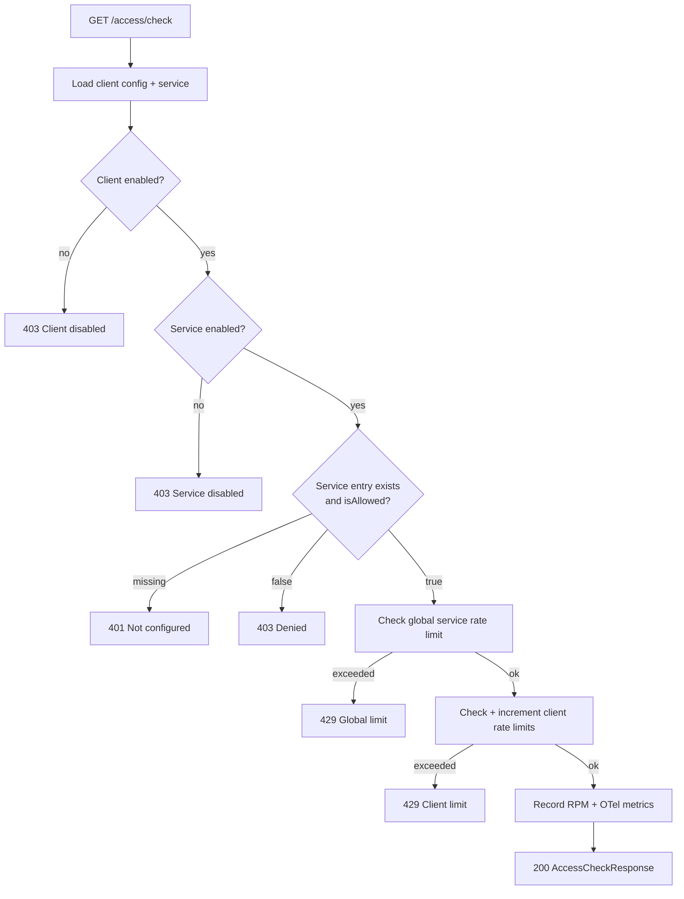
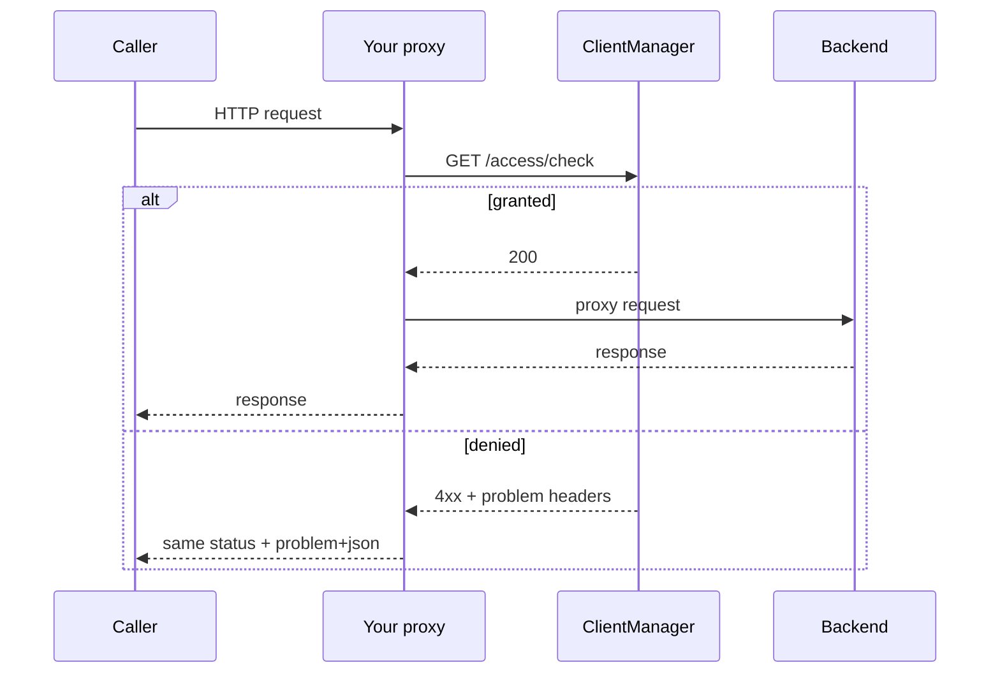

# Request flow

This page walks through what ClientManager does on the hot path — the code your reverse proxy or application calls on every inbound request. For configuration concepts, see the [Domain model](domain-model.md) first.

## API surface at a glance

| Operation | Method | Path | Side effects |
| --- | --- | --- | --- |
| Check access | `GET` | `/api/v1/access/check` | Increments rate limits; records RPM; emits OTel metrics |

All failures return [RFC 7807](https://datatracker.ietf.org/doc/html/rfc7807) `application/problem+json` with a `traceId`. The same payload is echoed in `X-Problem-*` response headers for edge proxies — see the [Integration guide](../integration-guide.md).

!!! note "Removed endpoints"
    Resource pool acquire/release, read-only accessibility reports (`GET /access/{clientId}`), and timeseries statistics were removed in the lean refactor. Integrate via access check only.

## Service access check

`GET /api/v1/access/check` accepts query parameters `clientId` and `serviceId`:

```
GET /api/v1/access/check?clientId=mobile-app&serviceId=pdf-render
```

On success:

```json
{
  "clientId": "mobile-app",
  "serviceId": "pdf-render",
  "remainingRequests": 37
}
```

`remainingRequests` reflects the tightest applicable client-side limit when the strategy exposes headroom.

### Pipeline order

`AccessControlService` evaluates gates in a fixed sequence. The first failure short-circuits with an HTTP error:



**Important:** this endpoint is not a free "peek". A successful check **consumes quota** the same way serving the downstream request would.

### HTTP status mapping

| Status | Typical cause |
| --- | --- |
| `400` | Unknown `clientId` |
| `401` | No `services[serviceId]` entry on the client configuration |
| `403` | Client disabled, service disabled, or `isAllowed: false` |
| `404` | Unknown `serviceId` |
| `429` | Global service limit or client rate limit exceeded |
| `503` | Storage backend unreachable |

### Global limit evaluation

Before client-specific limits run, the service checks whether a `GlobalRateLimit` exists for this `serviceId` (document ID = service ID):

- Clients with `exemptFromGlobalLimit` (or service-level override) skip the denial even when the counter is exhausted
- Clients with `contributesToGlobalLimit` disabled do not increment the shared counter
- Everyone else increments and can be denied when the aggregate limit is hit

### Client rate limit evaluation

`RateLimitService.CheckAndIncrementAsync` evaluates, in order:

1. Client-wide `globalRateLimit` (if configured)
2. Per-service `ServiceAccessSettings.rateLimit` (if configured)

Both use the configured strategy against counter state in the `RateLimiting` storage role.

## Typical integration pattern

Call access check at the edge, proxy to backend only on `200`:



See the [Integration guide](../integration-guide.md) for a full nginx `auth_request` example.

## Error handling middleware

Domain failures throw typed exceptions (`UnauthorizedException`, `RateLimitedException`, …). `ErrorHandlingMiddleware` maps them to problem responses:

- Rate limits attach `Retry-After` when computable
- Every body includes `traceId` for log correlation
- Problem fields are echoed in `X-Problem-*` headers for edge proxies

Integrators should **forward denial status and problem details** rather than masking them as `502 Bad Gateway`.

## Performance characteristics

Hot-path operations wrap in `StorageHotPathTrace` and record latency histograms. Reads use `IStorageReadCache` for catalog entities and global limit rules. Admin UI writes invalidate relevant cache entries without restarting the API.

## Related reading

- [Domain model](domain-model.md) — configuration that drives each gate
- [Usage and observability](usage-and-observability.md) — RPM and metrics
- [Integration guide](../integration-guide.md) — edge integration and status reference
- [Persistence overview](../persistence/index.md) — where counters live
