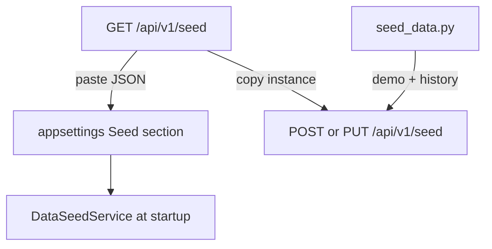

# Seed system

Catalog seed data is the **permissions and configuration** layer of ClientManager: services, resource pools, global rate limits, and client configurations. It does **not** include runtime statistics, allocations, or rate-limit counters.

Use seeds to copy an instance's catalog to another environment or to generate the appsettings `Seed` section for first-run bootstrap.

## Utilization paths

| Path | When to use |
| --- | --- |
| **Runtime seed API** (`GET` / `POST` / `PUT` `/api/v1/seed`) | Copy catalog between running instances; export from production-like data for import elsewhere |
| **appsettings `Seed`** | Bake catalog into deployment config; startup inserts missing IDs only (`skip` semantics) |
| **`seed_data.py`** | Large demo catalogs and optional `UsageSnapshots.json` history (catalog portion can use `/seed` instead) |



The runtime API reads and writes **only persisted catalog data**. It never reads appsettings. Export JSON uses the same shape as `SeedOptions` so you can paste it directly into configuration.

## Seed API

Base path: `/api/v1/seed` (Swagger tag: **Seeding**).

| Method | Purpose |
| --- | --- |
| `GET` | Export selected collections from the running instance |
| `POST` | **Wholesale replace** — delete all entities in each included collection, then insert from body |
| `PUT` | Per-ID import with `strategy=skip` (create missing only) or `strategy=replace` (upsert by ID) |

### `include` query parameter

Comma-separated collection names. Omitted = all four collections.

| Value | Collection |
| --- | --- |
| `services` | Service catalog |
| `resourcePools` or `resource-pools` | Resource pool catalog |
| `globalRateLimits` or `global-rate-limits` | Global rate limits |
| `clientConfigurations`, `client-configurations`, or `clients` | Client configurations |

Example — export clients and services only:

```http
GET /api/v1/seed?include=services,clients
```

### Response / request body

Same property names as appsettings `Seed`:

```json
{
  "services": [ ],
  "resourcePools": [ ],
  "globalRateLimits": [ ],
  "clientConfigurations": [ ]
}
```

Import responses return counts: `created`, `updated`, `skipped`, `deleted` (POST wholesale only).

### Error responses

| HTTP status | When |
| --- | --- |
| `400` | Unknown `include` token; invalid `strategy` on PUT; missing or malformed JSON body on POST/PUT |
| `503` | Storage backend unavailable |

Seed import is all-or-nothing at the HTTP level: unlike PATCH, there are no per-entity failures inside a `200` response.

### Instance-to-instance copy

1. On source: `GET /api/v1/seed` (optionally narrow with `?include=`).
2. On target:
   - **Mirror selected collections:** `POST /api/v1/seed?include=...` with the export body (destructive for included collections).
   - **Merge without deleting unmentioned IDs:** `PUT /api/v1/seed?strategy=replace` (overwrite matching IDs, create new ones).

### Saturate appsettings

1. `GET /api/v1/seed` from a configured instance.
2. Paste the JSON under the `Seed` section in `appsettings.json` (or environment-specific overrides).
3. Deploy; on startup `DataSeedService` creates any IDs that are still missing (`skip` — never overwrites existing runtime data).

### Combine multiple exports

Merge export JSON files manually before config or import: union each array by entity `id` (last write wins for duplicates). There is no server-side merge endpoint.

## PATCH vs seed

| Operation | Use for |
| --- | --- |
| `PATCH /api/v1/{resource}` | Surgical edits to one or more entities (partial fields only) |
| Seed export/import | Bulk copy or mirror entire catalog collections |

**PATCH errors:** `200` when all items succeed; `207` when mixed; `422` when all items fail — details in `results[].error`. Request-level `400` (bad body) or `503` (storage) fail the whole call.

See [API overview](../api-overview.md) for PATCH request shape and status tables.

## Related

- [Configuration reference — Seed](../configuration-reference.md#seed)
- [API overview — Seeding](../api-overview.md#seeding)
- [seed_data.py](../scripts/seed-data.md) — Python demo seeding and usage history
- [Getting started](../getting-started.md) — first-run seed commands
