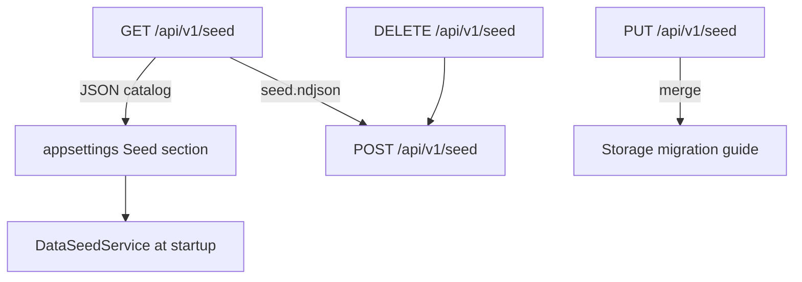

# Seed system

Catalog seed data is the **permissions and configuration** layer of ClientManager: services, resource pools, global rate limits, and client configurations. **Usage snapshots** (statistics history) can be exported and imported separately or together for [storage migration](../migration/storage-migration.md).

Use seeds to copy an instance's data to another environment, migrate between persistence providers, or generate the appsettings `Seed` section for first-run bootstrap.

## Utilization paths

| Path | When to use |
| --- | --- |
| **Runtime seed API** (`GET` / `DELETE` / `POST` / `PUT` `/api/v1/seed`) | Copy catalog and/or statistics between instances; migrate storage backends |
| **appsettings `Seed`** | Bake catalog into deployment config; startup inserts missing IDs only (`skip` semantics) |
| **`seed_data.py`** | Large demo catalogs and optional `UsageSnapshots.json` history for JsonFile dev setups |



## Seed API

Base path: `/api/v1/seed` (Swagger tag: **Seeding**).

| Method | Purpose |
| --- | --- |
| `GET` | Export selected collections |
| `DELETE` | Wipe selected collections (paginated internally) |
| `POST` | Import into **empty** included collections only |
| `PUT` | Merge with `strategy=skip` or `replace` |

**Long-running operations:** statistics export/import/delete can take a long time. Only one seed operation runs at a time (HTTP 409 if another is in progress). Do not issue concurrent seed requests.

### Response formats

| Condition | Format |
| --- | --- |
| Catalog-only export (default `include`) | JSON `SeedOptions` — paste into appsettings |
| `usageSnapshots` in `include`, or `format=ndjson` | Streamed `seed.ndjson` download |
| JSON `POST` / `PUT` | JSON `SeedImportSummary` |
| NDJSON `POST` / `PUT` | NDJSON stream with `_progress` and `_summary` lines |

### `include` query parameter

Comma-separated collection names. Omitted = all four **catalog** collections (`usageSnapshots` is never included by default).

| Value | Collection |
| --- | --- |
| `services` | Service catalog |
| `resourcePools` or `resource-pools` | Resource pool catalog |
| `globalRateLimits` or `global-rate-limits` | Global rate limits |
| `clientConfigurations`, `client-configurations`, or `clients` | Client configurations |
| `usageSnapshots`, `usage-snapshots`, or `statistics` | Usage snapshot time-series |

Example — export clients and services only:

```http
GET /api/v1/seed?include=services,clients
```

Example — export everything including statistics (NDJSON download):

```http
GET /api/v1/seed?include=services,clients,resourcePools,globalRateLimits,usageSnapshots
```

### POST vs DELETE vs PUT

| Operation | Behavior |
| --- | --- |
| **DELETE** | Removes all documents in each included collection. Use before POST when replacing data on a non-empty target. |
| **POST** | Inserts from the request body. **Fails with HTTP 409** if any included collection already has documents. Error text points to DELETE (wipe) or PUT (merge). |
| **PUT** | `strategy=skip` creates missing IDs only; `strategy=replace` upserts by ID without deleting unmentioned entities. |

This replaces the previous POST “wholesale replace” behavior (delete-then-insert in one call). Full replace is now explicit: **DELETE**, then **POST**.

### JSON body shape

Same property names as appsettings `Seed` (catalog arrays). Optional `usageSnapshots` array for small JSON imports:

```json
{
  "services": [ ],
  "resourcePools": [ ],
  "globalRateLimits": [ ],
  "clientConfigurations": [ ],
  "usageSnapshots": [ ]
}
```

Large statistics migrations should use NDJSON (`Content-Type: application/x-ndjson`) — see [storage migration](../migration/storage-migration.md).

Import responses return counts: `created`, `updated`, `skipped`, `deleted`, `processed`, `elapsedMs`.

### Error responses

| HTTP status | When |
| --- | --- |
| `400` | Unknown `include` token; invalid `strategy` on PUT; missing or malformed body |
| `409` | Included collection not empty on POST; another seed operation already running |
| `503` | Storage backend unavailable |

### Instance-to-instance copy

1. On source: `GET /api/v1/seed` (optionally narrow with `?include=`; add `usageSnapshots` for statistics).
2. On target:
   - **Replace:** `DELETE /api/v1/seed?include=...` then `POST` with export body (empty collections required).
   - **Merge:** `PUT /api/v1/seed?strategy=skip` or `replace`.

See [Storage migration](../migration/storage-migration.md) for curl examples.

### Saturate appsettings

1. `GET /api/v1/seed` from a configured instance (catalog only — do not include `usageSnapshots`).
2. Paste the JSON under the `Seed` section in `appsettings.json`.
3. Deploy; on startup `DataSeedService` creates any IDs that are still missing (`skip` — never overwrites existing runtime data).

## PATCH vs seed

| Operation | Use for |
| --- | --- |
| `PATCH /api/v1/{resource}` | Surgical edits to one or more entities (partial fields only) |
| Seed export/import | Bulk copy or migrate entire collections |

## Related

- [Storage migration](../migration/storage-migration.md) — provider X → empty Y with curl
- [Configuration reference — Seed](../configuration-reference.md#seed)
- [API overview — Seeding](../api-overview.md#seeding)
- [seed_data.py](../scripts/seed-data.md) — Python demo seeding and usage history
- [Getting started](../getting-started.md) — first-run seed commands
