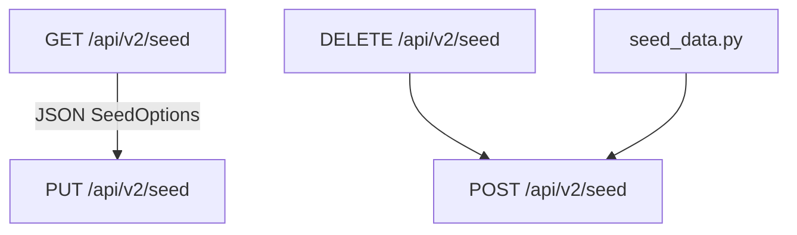

# Seed system

Catalog seed data is the **permissions and configuration** layer: services, global rate limits, and client configurations. Use seeds to copy an instance's catalog to another environment or bootstrap demo data.

## Utilization paths

| Path | When to use |
| --- | --- |
| **Runtime seed API** (`GET` / `DELETE` / `POST` / `PUT` `/api/v2/seed`) | Copy catalog between instances — **gated by `Seed:SeedApiEnabled`** |
| **`seed_data.py`** | POST demo catalog to a running API |



## Seed API

Base path: `/api/v2/seed` (Swagger tag: **Seeding**).

When `Seed:SeedApiEnabled` is `false`, all seed endpoints return **HTTP 404**.

| Method | Purpose |
| --- | --- |
| `GET` | Export selected collections as JSON `SeedOptions` |
| `DELETE` | Wipe selected collections (paginated internally) |
| `POST` | Import into **empty** included collections only |
| `PUT` | Merge with `strategy=skip` or `replace` |

Only one seed operation runs at a time (HTTP 409 if another is in progress).

### `include` query parameter

Comma-separated collection names. Omitted = all three catalog collections.

| Value | Collection |
| --- | --- |
| `services` | Service catalog |
| `globalRateLimits` or `global-rate-limits` | Global rate limits |
| `clientConfigurations`, `client-configurations`, or `clients` | Client configurations |

Example:

```http
GET /api/v2/seed?include=services,clients
```

### POST vs DELETE vs PUT

| Operation | Behavior |
| --- | --- |
| **DELETE** | Removes all documents in each included collection |
| **POST** | Inserts from JSON body. **Fails with HTTP 409** if any included collection already has documents |
| **PUT** | `strategy=skip` creates missing IDs only; `strategy=replace` upserts by ID |

### JSON body shape

```json
{
  "services": [ ],
  "globalRateLimits": [ ],
  "clientConfigurations": [ ]
}
```

Global rate limits use `id` = service ID with a nested `policy` object.

Import responses return counts: `created`, `updated`, `skipped`, `deleted`, `processed`, `elapsedMs`.

### Error responses

| HTTP status | When |
| --- | --- |
| `400` | Unknown `include` token; invalid `strategy` on PUT; missing or malformed body |
| `404` | `SeedApiEnabled` is `false` |
| `409` | Included collection not empty on POST; another seed operation running |
| `503` | Storage backend unavailable |

### Instance-to-instance copy

1. On source: `GET /api/v2/seed` (optionally narrow with `?include=`).
2. On target with `Seed:SeedApiEnabled: true`:
   - **Replace:** `DELETE /api/v2/seed?include=...` then `POST` with export body.
   - **Merge:** `PUT /api/v2/seed?strategy=skip` or `replace`.

## Catalog CRUD vs seed

| Operation | Use for |
| --- | --- |
| Catalog `POST` / `PUT` / `DELETE` | Surgical edits to individual entities |
| Seed export/import | Bulk copy or migrate entire collections |

## Related

- [Configuration reference — Seed](../configuration-reference.md#seed)
- [API overview — Seeding](../api-overview.md#seeding)
- [seed_data.py](../scripts/seed-data.md) — Python demo seeding
- [Getting started](../getting-started.md) — first-run seed commands
