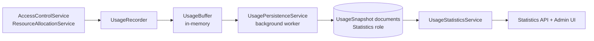

# Usage and observability

ClientManager records what happens on the hot path — grants, denials, acquisitions, releases — and turns that stream into dashboard charts, monitor views, and exportable metrics. This page explains the pipeline from in-memory events to the statistics API your operators (and the Admin UI) consume.

## What gets recorded

Runtime services call `IUsageRecorder` at decision points:

| Event | When | Target type |
| --- | --- | --- |
| `Granted` | Access check succeeds | `Service` |
| `Denied` | Access check fails (after identity/config resolved) | `Service` |
| `Acquired` | Resource slot successfully acquired | `ResourcePool` |
| `Released` | Explicit release via API | `ResourcePool` |

TTL-based cleanup of expired allocations **does not** produce a `Released` event. Operational counts for releases only reflect explicit API calls.

Each event is keyed by `(clientId, targetType, targetId, eventType)` and buffered in memory.

## From buffer to snapshots

Usage recording is deliberately decoupled from persistence so access checks stay fast:



`UsagePersistenceService` runs two flush loops:

- A **fast** loop batches recent increments for near-real-time dashboards
- A **slow** loop consolidates and rolls up data for longer retention

Snapshots store time-bucketed counts at multiple **granularities**:

| Granularity | Typical use |
| --- | --- |
| `Second` | Highest resolution; shortest retention |
| `FiveMinute` | Operational dashboards |
| `Hour` | Medium-term capacity planning |
| `Day` | Long-term trend analysis |

The system maintains separate snapshot series per granularity so the Admin UI can zoom from seconds to days without re-aggregating raw events on every query.

## Statistics services

Two services sit above the snapshot store:

### `UsageStatisticsService` (storage-internal)

Owns time-series queries, global usage rollups, and continuity calculations across bucket boundaries. Used by export helpers and the public statistics facade.

### `StatisticsService` (public API facade)

What controllers expose under `/api/v1/statistics/*`:

- System overview (client/service/pool counts, global usage summaries)
- Per-entity detail for dashboard drill-down
- Delegates heavy usage analytics to `IUsageStatisticsService`

The Admin UI's dashboard and monitor pages call these endpoints through `StatisticsApiService`.

## Read-only vs mutating queries

| Endpoint style | Increments counters? | Records usage? |
| --- | --- | --- |
| `POST /access/check` | Yes | Yes (`Granted` / `Denied`) |
| `GET /access/{clientId}` | No | No |
| `POST /resources/acquire` | Yes (pool limits) | Yes (`Acquired`) |
| `POST /resources/release` | No (decrements slot counters) | Yes (`Released`) |
| `GET /statistics/*` | No | No |

When building custom monitoring, prefer statistics and accessibility endpoints over repeated access checks.

## Caching

`IStorageReadCache` / `StorageReadCache` provides read-through caching with separate TTLs for:

- **Catalog reads** — clients, services, pools, global limit rules
- **Statistics reads** — aggregated usage responses

Catalog writes from the Admin UI invalidate affected cache entries. Statistics cache entries expire by TTL only.

Hot-path configuration reads benefit from caching; usage writes go to the in-memory buffer first, so recording does not block on snapshot persistence.

## Metrics and tracing

### OpenTelemetry / Prometheus

`StorageMetrics` and `ClientManagerMetrics` register counters and histograms for:

- Access check outcomes (granted / denied by reason)
- Resource acquire / release outcomes
- Rate-limit evaluations
- Storage operation latency

Scrape Prometheus-format metrics from `/prometheus/otel` on the API host.

Hot-path spans use the `StorageHotPathTrace` helper with operation names like `storage.access.check` and `storage.resource.acquire`. Tags include `client.id`, `service.id`, and `resource_pool.id`.

### Export endpoints

| Path | Format | Purpose |
| --- | --- | --- |
| `/api/v1/metrics/prometheus` | Prometheus text | External monitoring |
| `/api/v1/metrics/grafana` | Grafana-oriented JSON | Dashboard import helpers |

These complement — but do not replace — the statistics API for operator-facing charts in the Admin UI.

## Admin UI surfaces

The Blazor Admin UI visualizes the same data without direct database access:

| Page | Data source |
| --- | --- |
| **Dashboard** (`/`) | System overview, per-client usage charts, filterable time ranges |
| **Monitor** | Live accessibility report per client |
| **Active allocations** | Current pool slot holders |
| **Entity editors** | Catalog CRUD via respective API services |

Chart polling intervals and axis scale preferences are stored client-side in `UserPreferencesService`.

## Problem responses and incident correlation

Every HTTP error from the API includes a `traceId` in the problem body. Match this value to:

- API request logs (NLog)
- OpenTelemetry trace IDs on hot-path spans
- Prometheus counters tagged by denial reason

When a tenant reports unexpected `429` responses, check both per-client limits and global limits for the target service — aggregate exhaustion can deny clients who are individually under quota.

## Helper scripts

The repository includes Python utilities for local demos:

```powershell
# Seed catalog configuration
python _scripts/seed_data.py --base-url http://localhost:5062

# Generate live traffic for dashboard testing
python _scripts/traffic_generator.py --base-url http://localhost:5062 --interval 2.0
```

Stop the traffic generator before shutting down the API so buffered usage events can flush cleanly.

## Related reading

- [Request flow](request-flow.md) — when each event type is emitted
- [Domain model](domain-model.md) — targets and limits that shape usage patterns
- [Architecture overview](architecture.md) — background workers and observability endpoints
- [Persistence guide](../persistence-guide.md) — `Statistics` storage role and snapshot layout
