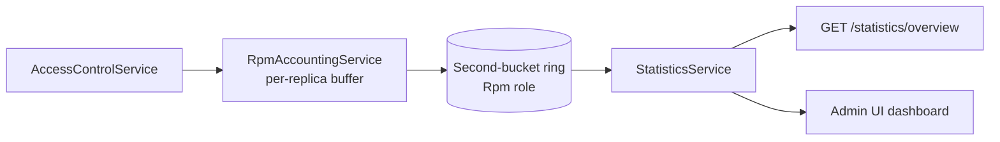

# Usage and observability

ClientManager records access-check outcomes for dashboard RPM and exports OpenTelemetry metrics for external monitoring.

## What gets recorded

On each successful access check, `RpmAccountingService` buffers one event per replica and flushes second-buckets into the `Rpm` storage role. OpenTelemetry counters and histograms record grants, denials, and latency on the hot path.

## RPM pipeline



`RpmAccountingService` batches flushes using `Rpm:FlushEventCount` and `Rpm:FlushInterval`. RPM is computed over a fixed **five-minute window** (`RpmOptions.RpmWindow`) from buckets in shared storage.

## Statistics API

`GET /api/v2/statistics/overview` returns:

- Total client count (catalog)
- Total service count (catalog)
- `requestsPerMinute` — global RPM from the bucket ring

The Admin UI dashboard polls this endpoint (default 10s) and shows three stat cards only.

## Read-only vs mutating queries

| Endpoint | Increments rate limits? | Records RPM? |
| --- | --- | --- |
| `GET /access/check` | Yes | Yes |
| `GET /statistics/overview` | No | No |

Do not poll access checks for monitoring — use `/prometheus/otel` instead.

## Caching

`IStorageReadCache` / `StorageReadCache` caches catalog reads with TTLs from the root `StorageReadCache` section:

| Scope | Contents | Typical invalidation |
| --- | --- | --- |
| **Catalog** | Clients, services, global limit rules | Catalog writes (`InvalidateCatalog`) |
| **Hot path** | Global limit lookups | Shorter `HotPathCatalogTtl` (default 1s) |

## Metrics and tracing

| Path | Purpose |
| --- | --- |
| `/prometheus/otel` | Runtime counters and histograms (HTTP, access, rate limits, storage latency) |
| `Observability:OtlpEndpoint` | OTLP trace export to Jaeger, Tempo, etc. |

Hot-path spans use operation names like `storage.access.check`, tagged with `client.id` and `service.id`.

**For Prometheus scrape config, Grafana, and example alerts**, see the [Observability guides](../observability/index.md).

## Admin UI surfaces

| Page | Data source |
| --- | --- |
| **Dashboard** (`/`) | Three cards: client count, service count, RPM |
| **Entity editors** | Catalog CRUD via API services |

## Problem responses and incident correlation

Every HTTP error includes a `traceId` in the problem body. Match it to API logs (NLog) and OpenTelemetry spans.

When a tenant reports unexpected `429` responses, check both per-client limits and the global limit for the service (`GlobalRateLimit` keyed by `serviceId`).

## Helper scripts

```powershell
python _scripts/seed_data.py --base-url http://localhost:5062
python _scripts/traffic_generator.py --base-url http://localhost:5062 --interval 2.0
```

## Related reading

- [Observability guides](../observability/index.md) — local stack, on-prem deploy, org Grafana/Prometheus
- [Request flow](request-flow.md) — when RPM and metrics are emitted
- [Domain model](domain-model.md) — limits that shape traffic
- [Architecture overview](architecture.md) — observability endpoints
- [Persistence overview](../persistence/index.md) — `Rpm` storage role
