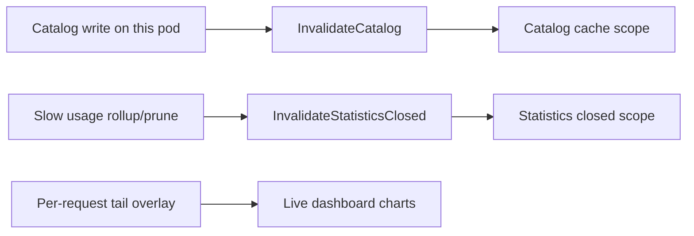

# Danger zone

The `DangerZone` appsettings section gates capabilities that can **wipe or override production data**, or **widen cross-pod cache staleness**. Normal operational settings stay in their existing top-level sections.

!!! warning "Production defaults are restrictive"
    When `DangerZone` gates are omitted and `ASPNETCORE_ENVIRONMENT=Production`, seed HTTP endpoints and startup seeding are **disabled**. You must opt in explicitly for migration windows or bootstrap.

## What belongs here (and what does not)

| In `DangerZone` | Outside `DangerZone` | Why |
| --- | --- | --- |
| Seed HTTP API gates (`EnableSeedExport`, `EnableSeedImport`) | Root `Seed` catalog data arrays | Data definition vs execution |
| Startup seed gate (`EnableStartupSeeding`) | `UsageTracking` retention windows | Retention is normal ops tuning; only prune on/off is gated |
| Usage prune gate (`EnableUsagePruning`) | `Persistence:AllowInsecureTls` | Some backends require relaxed TLS |
| Cache TTL overrides (`StorageReadCache`) | Swagger, Prometheus, metrics API | Discovery and observability are not destructive |

Internal cache **invalidation on writes** (catalog CRUD, rollup/prune) is code-driven and **not** configurable. TTL tuning is the operator lever for cross-pod staleness.

## Configuration shape

```json
{
  "Seed": {
    "ClientConfigurations": [],
    "Services": []
  },
  "DangerZone": {
    "EnableStartupSeeding": false,
    "EnableSeedExport": false,
    "EnableSeedImport": false,
    "EnableUsagePruning": true,
    "StorageReadCache": {
      "CatalogTtl": "00:00:30",
      "HotPathCatalogTtl": "00:00:01",
      "StatisticsTtl": "00:00:05"
    }
  }
}
```

Environment variables use double underscores:

```bash
DangerZone__EnableSeedImport=true
DangerZone__StorageReadCache__CatalogTtl=00:01:00
```

The top-level `StorageReadCache` section is **removed**. Use `DangerZone:StorageReadCache` only.

## Gates reference

Boolean gates bind as nullable values. When omitted, environment defaults apply:

| Gate | Controls | Production default | Development default |
| --- | --- | --- | --- |
| `EnableStartupSeeding` | Whether `DataSeedService` runs when root `Seed` exists | `false` | `true` |
| `EnableSeedExport` | `GET /api/v1/seed` | `false` | `true` |
| `EnableSeedImport` | `POST` / `PUT` / `DELETE /api/v1/seed` | `false` | `true` |
| `EnableUsagePruning` | Background deletion of expired usage buckets | `true` | `true` |

When a gate is off, affected HTTP endpoints return **HTTP 404** (not 403).

### `EnableStartupSeeding`

The root `Seed` section defines catalog entities to ensure at startup. This gate controls whether import actually runs.

- **On:** `DataSeedService` runs once at startup with skip semantics (creates missing IDs only; never overwrites existing documents).
- **Off:** `Seed` data in config is ignored at startup (useful for reference or export templates).

**Production bootstrap recipe:**

1. Deploy with `Seed` populated and `EnableStartupSeeding: true`.
2. Confirm catalog exists.
3. Redeploy with `EnableStartupSeeding: false` so later releases cannot mutate catalog from baked-in config.

### `EnableSeedExport`

Allows read-only export of catalog and optional statistics history.

```bash
curl "http://localhost:5062/api/v1/seed"
curl "http://localhost:5062/api/v1/seed?include=usageSnapshots" -o seed.ndjson
```

Export leaks full configuration and usage history. Enable temporarily for migration, then disable.

### `EnableSeedImport`

Allows destructive seed verbs:

| Method | Risk |
| --- | --- |
| `DELETE` | Wipes included collections |
| `POST` | Imports into empty collections |
| `PUT` | Merges; `strategy=replace` upserts by ID |

Split from export so Production can allow read-only migration exports while blocking wipes.

```bash
# Requires EnableSeedImport=true
curl -X DELETE "http://localhost:5062/api/v1/seed?include=clients"
curl -X PUT "http://localhost:5062/api/v1/seed?strategy=replace" \
  -H "Content-Type: application/json" --data-binary @seed.json
```

### `EnableUsagePruning`

When `true` (default), the usage persistence slow loop deletes expired snapshot buckets per `UsageTracking` retention windows.

When `false`, rollups continue but prune is skipped — historical buckets accumulate until pruning is re-enabled. Use only in forensic or migration windows; disk usage grows without bound.

## `StorageReadCache` TTLs

Bind under `DangerZone:StorageReadCache`. When omitted, code defaults apply and caching still runs.

| Property | Default | Governs |
| --- | --- | --- |
| `CatalogTtl` | `00:00:30` | Clients, services, pools, global limits (admin/catalog reads) |
| `HotPathCatalogTtl` | `00:00:01` | Global-limit rule lookups on `GET /api/v1/access/check` |
| `StatisticsTtl` | `00:00:05` | Closed statistics base reads and exporter queries |

### Invalidation scopes

Three independent invalidation scopes exist in `IStorageReadCache`:



| Scope | Typical invalidation | Cross-pod staleness bound by |
| --- | --- | --- |
| **Catalog** | Admin UI / API catalog writes on **this** pod | `CatalogTtl` / `HotPathCatalogTtl` on **other** pods |
| **Statistics closed** | Rollup/prune on slow usage loop | `StatisticsTtl` |
| **Statistics tail** | Not invalidated on every fast flush; overlay handles live data | Mostly per-request overlay, not TTL alone |

### Tuning guidance

| Symptom | Knob | Direction |
| --- | --- | --- |
| Config changes slow to propagate across pods | `CatalogTtl` | Lower |
| High storage read load on hot path | `HotPathCatalogTtl` | Raise (accept staleness) |
| Stale closed statistics after rollup | `StatisticsTtl` | Lower |
| Dashboard load spikes | `StatisticsTtl` | Raise (accept staleness on closed base) |

!!! note "Local pod vs other pods"
    Writes invalidate cache on the **local** pod immediately. TTLs matter for **other** replicas that did not observe the write.

## Production checklist

Recommended Production `DangerZone` for a steady-state deployment:

```json
{
  "DangerZone": {
    "EnableStartupSeeding": false,
    "EnableSeedExport": false,
    "EnableSeedImport": false,
    "EnableUsagePruning": true
  }
}
```

Omit `StorageReadCache` to use defaults unless you have measured cross-pod staleness issues.

## Example workflows

### Instance copy (export enabled, import temporarily enabled)

On source (Production):

```json
{
  "DangerZone": {
    "EnableSeedExport": true,
    "EnableSeedImport": false
  }
}
```

On target during migration window:

```json
{
  "DangerZone": {
    "EnableSeedExport": false,
    "EnableSeedImport": true
  }
}
```

1. `GET /api/v1/seed` on source.
2. `DELETE` then `POST`, or `PUT` with `strategy=replace` on target.
3. Disable `EnableSeedImport` on target.

### Multipod Docker (Development)

`compose/multipod.yml` sets `ASPNETCORE_ENVIRONMENT: Development`, so seed gates default to **on** when `DangerZone` is omitted. No compose changes required for local multipod work.

To tune cache staleness across three API replicas:

```yaml
environment:
  DangerZone__StorageReadCache__CatalogTtl: "00:00:10"
  DangerZone__StorageReadCache__HotPathCatalogTtl: "00:00:01"
```

### Forensic retention hold

```json
{
  "DangerZone": {
    "EnableUsagePruning": false
  },
  "UsageTracking": {
    "DailyRetention": "365.00:00:00"
  }
}
```

Prune is paused; rollups still run. Re-enable pruning after the investigation.

## Related reading

- [Configuration reference — DangerZone](configuration-reference.md#dangerzone)
- [Seed system](core/seed-system.md)
- [Usage and observability — cache scopes](core/usage-and-observability.md)
- [Development and operations](development-and-operations.md)

## Runnable check

Verify binding and defaults:

```powershell
dotnet run --project ClientManager.Api -- --danger-zone-check
```

Exit code `0` means the guard passed.
