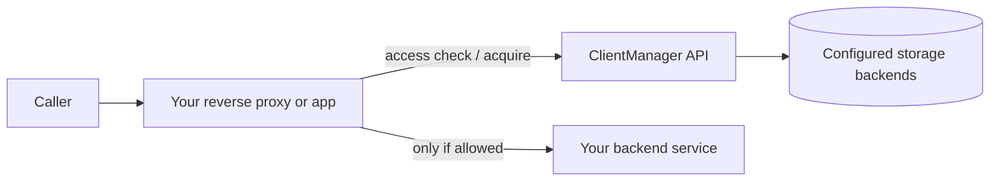

# ClientManager documentation

ClientManager is a layered .NET service for **client access control**, **rate limiting**, **resource pool allocation**, and **usage statistics**. Your applications call its HTTP API at request time; operators configure clients, services, and limits through the Admin UI or the catalog API.

These guides explain how to wire ClientManager into your stack and how its persistence layer behaves.

## Guides

| Guide | What you will learn |
| --- | --- |
| [Integration guide](integration-guide.md) | Put ClientManager in front of your services with nginx, identify callers, and surface denials (401, 403, 429, …) to end users |
| [Persistence guide](persistence-guide.md) | How storage roles map to MongoDB, Redis, and file-backed providers |

## Quick mental model



ClientManager is **not** a user directory. It answers operational questions for each request:

- Is this **client** allowed to use this **service** right now?
- Is the client under its **rate limit**?
- Can the client **acquire a slot** from a **resource pool**?

Every denial is an HTTP error with an [RFC 7807](https://datatracker.ietf.org/doc/html/rfc7807) `application/problem+json` body. Your integration should forward that status (and ideally the body) to the caller instead of masking it as a generic 502.

## Build this site locally

Install the doc dependencies and serve the site with live reload:

```powershell
pip install -r docs/requirements.txt
mkdocs serve
```

Open [http://127.0.0.1:8000](http://127.0.0.1:8000). To emit a static `site/` folder suitable for GitHub Pages, Azure Static Web Apps, or any static host:

```powershell
mkdocs build
```

The output lands in `site/` at the repository root.

## API surface (v1)

| Operation | Method | Path |
| --- | --- | --- |
| Check access | `POST` | `/api/v1/access/check` |
| Client accessibility report | `GET` | `/api/v1/access/{clientId}` |
| Acquire resource slot | `POST` | `/api/v1/resources/acquire` |
| Release resource slot | `POST` | `/api/v1/resources/release` |

Interactive OpenAPI documentation is available from the running API host (Swagger UI in development).

## Related repository docs

These files live at the repository root (outside this doc site):

- `README.md` — build, run, and persistence quick start
- `ClientManager.DataAccess/README.md` — data-access layer notes
