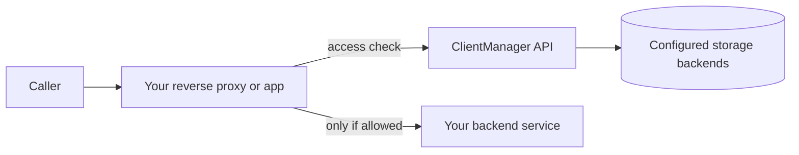

# ClientManager documentation

ClientManager is a layered .NET service for **client access control**, **rate limiting**, and **RPM accounting**. Your applications call its HTTP API at request time; operators configure clients, services, and limits through the Admin UI or the catalog API.

These guides explain how ClientManager works internally, how to wire it into your stack, and how its persistence layer behaves.

## Guides

### New to the repository

| Guide | What you will learn |
| --- | --- |
| [Getting started](getting-started.md) | Solution layout, first run, Docker, seed data, and where to read next |
| [Configuration reference](configuration-reference.md) | Every `appsettings` section, defaults, and environment-variable overrides |
| [Danger zone](development-and-operations.md#danger-zone) | Gates for seed API, cache TTL tuning, and destructive compose operations |
| [Admin UI guide](admin-ui-guide.md) | Operator screens, routes, and typical workflows |
| [Localization](localization.md) | Admin UI languages, `.resx` workflow, RTL, and adding cultures |
| [API overview](api-overview.md) | Catalog CRUD, statistics, metrics, and runtime endpoints |
| [Development and operations](development-and-operations.md) | Scripts, security model, deployment notes, troubleshooting |
| [Observability guides](observability/index.md) | Local stack, on-prem deploy, org Grafana/Prometheus, pod discovery |

### Core concepts

| Guide | What you will learn |
| --- | --- |
| [Architecture overview](core/architecture.md) | Solution structure, API vs Admin UI, internal layering, and how doc files map to site URLs |
| [Domain model](core/domain-model.md) | Clients, services, rate limits, and how settings override each other |
| [Request flow](core/request-flow.md) | Access-check pipeline and HTTP status mapping |
| [Usage and observability](core/usage-and-observability.md) | RPM accounting, statistics API, and OpenTelemetry metrics |
| [Seed system](core/seed-system.md) | Export/import catalog seed data, appsettings `Seed`, and instance copy workflows |

### Integration and operations

| Guide | What you will learn |
| --- | --- |
| [Integration guide](integration-guide.md) | Put ClientManager in front of your services with nginx, identify callers, and surface denials (401, 403, 429, …) to end users |
| [Observability guides](observability/index.md) | Local stack, on-prem deploy, org Grafana/Prometheus |
| [Persistence overview](persistence/index.md) | How storage roles map to MongoDB and Redis |

## Quick mental model



ClientManager is **not** a user directory. It answers operational questions for each request:

- Is this **client** allowed to use this **service** right now?
- Is the client under its **rate limit**?

Every denial is an HTTP error with an [RFC 7807](https://datatracker.ietf.org/doc/html/rfc7807) `application/problem+json` body. The same fields are echoed in `X-Problem-*` headers for nginx `auth_request`. Your integration should forward that status and problem details to the caller instead of masking it as a generic 502.

## How files become pages

This site is built with [MkDocs](https://www.mkdocs.org/). A few rules govern what you see in the browser:

- Markdown files live under `docs/`. A file at `docs/core/domain-model.md` is published at `/core/domain-model/` on the built site.
- **Links only work between pages under `docs/`.** Repo paths (`compose/…`, `_scripts/…`, `observability/…`) are shown as inline `` `code` `` — open them in the repository, not via the doc site.
- The **sidebar** order and section nesting come from the `nav` block in `mkdocs.yml` at the repository root — not from the folder tree alone.
- A page can exist without a `nav` entry (it still builds), but it will only be reachable via direct URL or links from other pages.

To add a new guide: create the `.md` file under `docs/`, add it to `nav` in `mkdocs.yml`, and link it from `index.md` if it should appear on the home page.

## Build this site locally

Install the doc dependencies and serve the site with live reload:

```powershell
pip install -r docs/requirements.txt
mkdocs serve
```

Open [http://127.0.0.1:8000](http://127.0.0.1:8000). To emit a static `site/` folder suitable for GitHub Pages, Azure Static Web Apps, or any static host:

```powershell
mkdocs build
```

The output lands in `site/` at the repository root.

Mermaid (`docs/javascripts/mermaid.min.js`) is vendored for offline use.

## API surface (v2)

| Operation | Method | Path |
| --- | --- | --- |
| Check access | `GET` | `/api/v2/access/check?clientId=…&serviceId=…` |
| Catalog CRUD | `POST` / `GET` / `PUT` / `DELETE` | `/api/v2/clients`, `/api/v2/services`, `/api/v2/global-rate-limits` |
| Statistics | `GET` | `/api/v2/statistics/overview` |
| Seed export/import | `GET` / `POST` / `PUT` / `DELETE` | `/api/v2/seed` |
| Metrics | `GET` | `/prometheus/otel` |

Full reference: [API overview](api-overview.md) and Swagger UI at `/docs` on the running API host.

## Related repository docs

These files live at the repository root (outside this doc site):

- `README.md` — build, run, and persistence quick start
- `ClientManager.Api/Storage/` — in-process document stores, databases, and repositories
