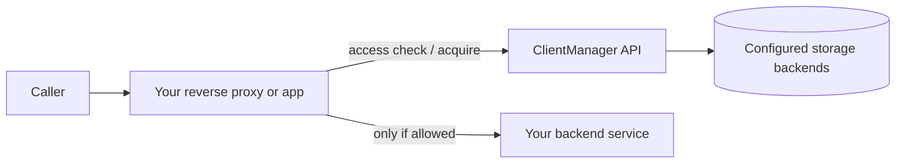

# ClientManager documentation

ClientManager is a layered .NET service for **client access control**, **rate limiting**, **resource pool allocation**, and **usage statistics**. Your applications call its HTTP API at request time; operators configure clients, services, and limits through the Admin UI or the catalog API.

These guides explain how ClientManager works internally, how to wire it into your stack, and how its persistence layer behaves.

## Guides

### New to the repository

| Guide | What you will learn |
| --- | --- |
| [Getting started](getting-started.md) | Solution layout, first run, Docker, seed data, and where to read next |
| [Configuration reference](configuration-reference.md) | Every `appsettings` section, defaults, and environment-variable overrides |
| [Admin UI guide](admin-ui-guide.md) | Operator screens, routes, and typical workflows |
| [Localization](localization.md) | Admin UI languages, `.resx` workflow, RTL, and adding cultures |
| [API overview](api-overview.md) | Catalog CRUD, statistics, metrics, and runtime endpoints |
| [Development and operations](development-and-operations.md) | Scripts, security model, deployment notes, troubleshooting |
| [Metrics integration guide](metrics-integration-guide.md) | Prometheus, Grafana, Jaeger, OTLP — scrape targets, metric catalog, alerts |

### Core concepts

| Guide | What you will learn |
| --- | --- |
| [Architecture overview](core/architecture.md) | Solution structure, API vs Admin UI, internal layering, and how doc files map to site URLs |
| [Domain model](core/domain-model.md) | Clients, services, resource pools, rate limits, allocations, and how settings override each other |
| [Request flow](core/request-flow.md) | Ordered pipelines for access checks and resource acquisition, with HTTP status mapping |
| [Usage and observability](core/usage-and-observability.md) | Usage recording, statistics API, metrics, and Admin UI dashboards |

### Integration and operations

| Guide | What you will learn |
| --- | --- |
| [Integration guide](integration-guide.md) | Put ClientManager in front of your services with nginx, identify callers, and surface denials (401, 403, 429, …) to end users |
| [Metrics integration guide](metrics-integration-guide.md) | Plug into Prometheus, Grafana, or OTLP collectors for metrics and traces |
| [Persistence guide](persistence-guide.md) | How storage roles map to MongoDB, Redis, and file-backed providers |

## Quick mental model



ClientManager is **not** a user directory. It answers operational questions for each request:

- Is this **client** allowed to use this **service** right now?
- Is the client under its **rate limit**?
- Can the client **acquire a slot** from a **resource pool**?

Every denial is an HTTP error with an [RFC 7807](https://datatracker.ietf.org/doc/html/rfc7807) `application/problem+json` body. The same fields are echoed in `X-Problem-*` headers for nginx `auth_request`. Your integration should forward that status and problem details to the caller instead of masking it as a generic 502.

## How files become pages

This site is built with [MkDocs](https://www.mkdocs.org/). A few rules govern what you see in the browser:

- Markdown files live under `docs/`. A file at `docs/core/domain-model.md` is published at `/core/domain-model/` on the built site.
- The **sidebar** order and section nesting come from the `nav` block in `mkdocs.yml` at the repository root — not from the folder tree alone.
- A page can exist without a `nav` entry (it still builds), but it will only be reachable via direct URL or links from other pages.

To add a new guide: create the `.md` file under `docs/`, add it to `nav` in `mkdocs.yml`, and link it from `index.md` if it should appear on the home page.

## Build this site locally

Install the doc dependencies and serve the site with live reload:

```powershell
pip install -r docs/requirements.txt
mkdocs serve
```

Open [http://127.0.0.1:8000](http://127.0.0.1:8000). To emit a static `site/` folder suitable for GitHub Pages, Azure Static Web Apps, or any static host:

```powershell
mkdocs build
```

The output lands in `site/` at the repository root.

Mermaid (`docs/javascripts/mermaid.min.js`) is vendored for offline use.

## API surface (v1)

| Operation | Method | Path |
| --- | --- | --- |
| Check access | `GET` | `/api/v1/access/check?clientId=…&serviceId=…` |
| Client accessibility report | `GET` | `/api/v1/access/{clientId}` |
| Acquire resource slot | `GET` | `/api/v1/resources/acquire?clientId=…&resourcePoolId=…` |
| Release resource slot | `GET` | `/api/v1/resources/release?allocationId=…` |

Interactive OpenAPI documentation is available from the running API host (Swagger UI in development).

## Related repository docs

These files live at the repository root (outside this doc site):

- `README.md` — build, run, and persistence quick start
- `ClientManager.DataAccess/README.md` — data-access layer notes
