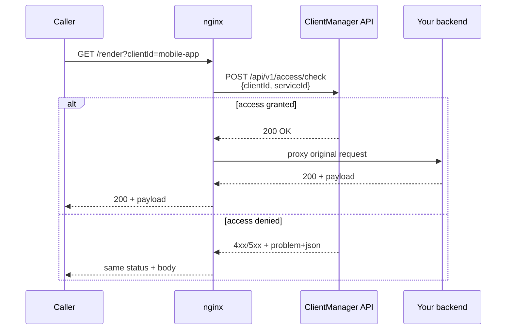
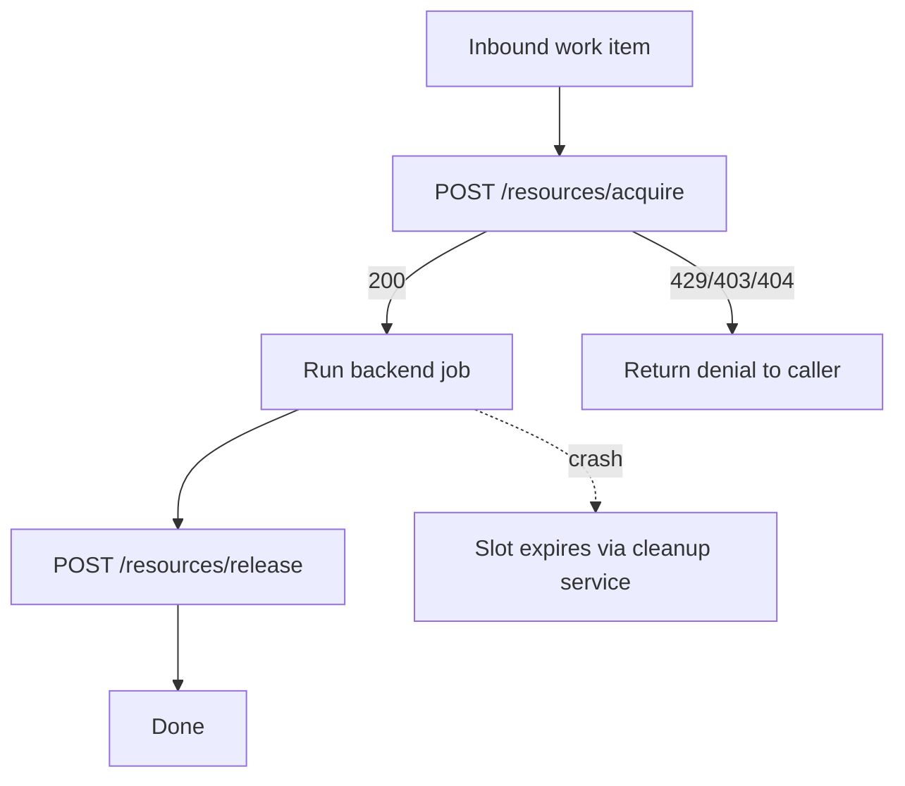

# Integration guide

This guide shows how to **plug ClientManager into your software** so every inbound request is evaluated before it reaches your backend. The worked example uses **nginx** as a reverse proxy, derives the client from a **URL query parameter**, calls ClientManager on the correct API path, and **returns any non-200 ClientManager response** to the caller unchanged.

## What you are integrating

ClientManager sits beside your services and answers gatekeeping questions over HTTP:

| Question | Endpoint | Success | Typical denials |
| --- | --- | --- | --- |
| May this client use this service? | `POST /api/v1/access/check` | `200` | `401`, `403`, `404`, `429`, `503` |
| May this client take a pool slot? | `POST /api/v1/resources/acquire` | `200` | `403`, `404`, `429`, `503` |
| Release a slot | `POST /api/v1/resources/release` | `200` | `404`, `503` |

On success, access checks return JSON with optional rate-limit headroom:

```json
{
  "clientId": "mobile-app",
  "serviceId": "pdf-render",
  "remainingRequests": 37
}
```

On failure, the API returns `application/problem+json`:

```json
{
  "title": "Too Many Requests",
  "status": 429,
  "detail": "Rate limit exceeded",
  "traceId": "00-abc123..."
}
```

Rate-limited responses also include a `Retry-After` header when the limit strategy can compute one.

!!! tip "Deny by default"
    A client must have an explicit `isAllowed: true` entry for a service in its configuration. Missing configuration is `401 Unauthorized`; disabled clients, disabled services, or disallowed relationships are `403 Forbidden`.

## End-to-end flow



The access check **increments rate-limit counters** and records usage. Treat it as “this request is about to be served”, not a free cacheable peek. For dashboards that must not consume quota, use `GET /api/v1/access/{clientId}` instead (read-only report).

## Identifying the client

ClientManager does not guess who is calling. **Your edge layer must supply `clientId`** (and, for access checks, which `serviceId` is being protected).

Common patterns:

| Source | Example | Good for |
| --- | --- | --- |
| Query parameter | `?clientId=mobile-app` | Public APIs, simple integrations, demos |
| Path segment | `/clients/mobile-app/render` | Versioned multi-tenant URLs |
| Header | `X-Client-Id: mobile-app` | Server-to-server traffic behind a trusted proxy |
| JWT / API key mapping | Map `sub` or key id → `clientId` in njs or app middleware | Production |

This guide uses a **query parameter** because it is easy to test with curl and keeps the nginx config short. In production, prefer headers or signed tokens so callers cannot impersonate another client by editing the query string.

### Mapping routes to `serviceId`

Register each protected backend capability as a **service** in ClientManager (for example `pdf-render`, `ml-inference`). Your proxy must send the service id that corresponds to the upstream you are about to call. A static mapping per `location` block is usually enough:

```nginx
# Inside the location that proxies to the PDF renderer:
set $cm_service_id "pdf-render";
```

## nginx example: auth subrequest with njs

nginx’s built-in `auth_request` module issues a **GET** subrequest, but ClientManager’s access check is **POST** with a JSON body. Bridge the gap with the **njs** module (`ngx_http_js_module`), which can `fetch()` the ClientManager API and return the upstream status to nginx.

### 1. njs access script

Save as `conf/clientmanager-auth.js` (path is up to you):

```javascript
const CM_BASE = "http://clientmanager-api:5062";
const CM_SERVICE_ID = "pdf-render";

function readClientId(r) {
    // Prefer a trusted header; fall back to query param for the demo.
    const header = r.headersIn["X-Client-Id"];
    if (header) {
        return header;
    }

    const args = r.args; // e.g. "clientId=mobile-app&page=1"
    const match = /(?:^|&)clientId=([^&]+)/.exec(args);
    return match ? decodeURIComponent(match[1]) : "";
}

async function checkAccess(r) {
    const clientId = readClientId(r);

    if (!clientId) {
        r.return(400, JSON.stringify({
            title: "Bad Request",
            status: 400,
            detail: "Missing clientId query parameter or X-Client-Id header."
        }));
        return;
    }

    const response = await ngx.fetch(CM_BASE + "/api/v1/access/check", {
        method: "POST",
        headers: { "Content-Type": "application/json" },
        body: JSON.stringify({
            clientId: clientId,
            serviceId: CM_SERVICE_ID
        })
    });

    const body = await response.text();
    const headers = {};

    const retryAfter = response.headers.get("Retry-After");
    if (retryAfter) {
        headers["Retry-After"] = retryAfter;
    }

    headers["Content-Type"] = response.headers.get("Content-Type") || "application/problem+json";

    r.return(response.status, body, headers);
}

export default { checkAccess };
```

### 2. nginx configuration

```nginx
load_module modules/ngx_http_js_module.so;

js_import clientmanager from conf/clientmanager-auth.js;

upstream pdf_backend {
    server pdf-renderer:8080;
}

server {
    listen 443 ssl;
    server_name api.example.com;

  # ssl_certificate ...;
  # ssl_certificate_key ...;

    # Internal auth handler — not exposed to clients.
    location = /_clientmanager/access-check {
        internal;
        js_content clientmanager.checkAccess;
    }

    location /render {
        auth_request /_clientmanager/access-check;

        # Capture status, body, and retry hint from the auth subrequest.
        auth_request_set $cm_status $upstream_status;
        auth_request_set $cm_body $upstream_response_body;
        auth_request_set $cm_retry $upstream_http_retry_after;

        # Any non-2xx/3xx auth result stops the request and is returned to the caller.
        error_page 400 401 403 404 429 500 502 503 504 = @clientmanager_error;

        proxy_pass http://pdf_backend;
        proxy_set_header X-Client-Id $arg_clientId;
    }

    location @clientmanager_error {
        internal;
        add_header Retry-After $cm_retry always;
        default_type application/problem+json;
        return $cm_status $cm_body;
    }
}
```

!!! note "Status and body passthrough"
    The `error_page … = @clientmanager_error` pattern forwards the auth subrequest’s HTTP status and response body to the original caller. If your nginx build cannot use `return $cm_status $cm_body`, return a fixed `JSON` map keyed by `$cm_status` or proxy the auth location externally — the contract remains: **do not call your backend** when ClientManager denies access.

### 3. Try it

With ClientManager and your backend running:

```bash
# Allowed client (configured in Admin UI / seed data)
curl -i "https://api.example.com/render?clientId=mobile-app"

# Unknown client → 404 from ClientManager, proxied to caller
curl -i "https://api.example.com/render?clientId=unknown-tenant"

# Rate limited → 429 + Retry-After
curl -i "https://api.example.com/render?clientId=mobile-app"
```

## Calling the API directly (without nginx)

Useful for application-level integration, workers, or tests:

```bash
curl -sS -X POST http://localhost:5062/api/v1/access/check \
  -H "Content-Type: application/json" \
  -d '{"clientId":"mobile-app","serviceId":"pdf-render"}'
```

Resource pool acquire/release follow the same pattern:

```bash
# Acquire
curl -sS -X POST http://localhost:5062/api/v1/resources/acquire \
  -H "Content-Type: application/json" \
  -d '{"clientId":"mobile-app","resourcePoolId":"pdf-render-slots"}'

# Release
curl -sS -X POST http://localhost:5062/api/v1/resources/release \
  -H "Content-Type: application/json" \
  -d '{"allocationId":"<id-from-acquire>"}'
```

Acquire before starting expensive work; release in a `finally` block (or rely on allocation expiry if your process crashes).



## HTTP status reference

| Status | Meaning | Typical cause |
| --- | --- | --- |
| `200` | Allowed / acquired / released | Request passed all gates |
| `400` | Bad request | Your proxy did not supply `clientId` |
| `401` | Unauthorized | No access configuration for this client–service pair |
| `403` | Forbidden | Client disabled, service disabled, or `isAllowed: false` |
| `404` | Not found | Unknown `clientId`, `serviceId`, `resourcePoolId`, or `allocationId` |
| `429` | Too many requests | Client, global service, or pool rate/slot limit exceeded |
| `503` | Service unavailable | Storage backend unreachable |

Always log ClientManager’s `traceId` from error bodies when opening incidents — it matches API request logs.

## Integration checklist

1. **Register services** in ClientManager that mirror the capabilities you protect (`pdf-render`, `billing-service`, …).
2. **Create a client configuration** per tenant/integration with explicit `isAllowed` entries and optional rate limits.
3. **Choose a stable `clientId` source** (header or token mapping in production; query param for demos).
4. **Call `POST /api/v1/access/check`** before backend work (via nginx njs, app middleware, or API gateway plugin).
5. **Forward non-`200` responses** verbatim — status, `problem+json` body, and `Retry-After` when present.
6. **Use resource pools** when you need concurrency caps in addition to request-rate limits.
7. **Monitor** ClientManager metrics and the statistics API to validate limits in staging before enforcing them in production.

## Alternative integration points

| Layer | When to use it |
| --- | --- |
| **nginx / Envoy / Traefik** | Centralized edge gate for many stateless HTTP services |
| **App middleware** (ASP.NET, Express, …) | Fine-grained context, easier unit tests, no njs |
| **API gateway policy** (Kong, APIM, …) | Enterprise policy, JWT validation, per-route plugins |

The contract is the same everywhere: supply `clientId` + `serviceId`, honor the HTTP result, and only then execute backend logic.

## Related reading

- [Persistence guide](persistence-guide.md) — configure shared Redis/Mongo for multi-instance deployments
- Repository `README.md` — run the API locally and seed demo data
