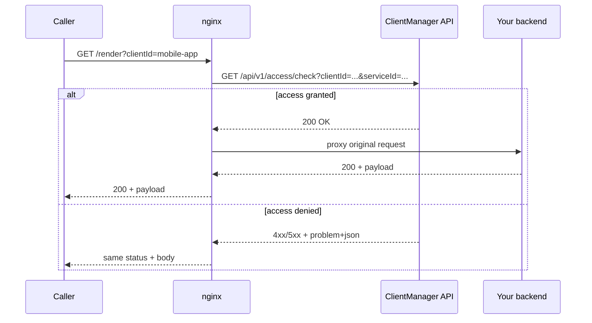
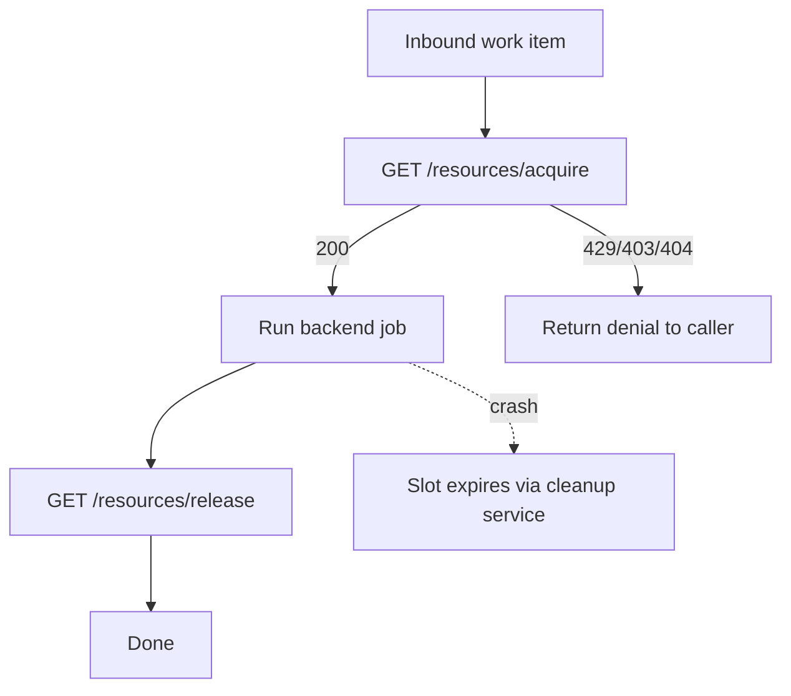

# Integration guide

This guide shows how to **plug ClientManager into your software** so every inbound request is evaluated before it reaches your backend. The worked example uses **nginx** `auth_request`, which issues a **GET** subrequest — matching ClientManager's runtime gatekeeping endpoints.

## What you are integrating

ClientManager sits beside your services and answers gatekeeping questions over HTTP:

| Question | Endpoint | Success | Typical denials |
| --- | --- | --- | --- |
| May this client use this service? | `GET /api/v1/access/check` | `200` | `401`, `403`, `404`, `429`, `503` |
| May this client take a pool slot? | `GET /api/v1/resources/acquire` | `200` | `403`, `404`, `429`, `503` |
| Release a slot | `GET /api/v1/resources/release` | `200` | `404`, `503` |

All three endpoints accept parameters as **query strings** (not a JSON body), so reverse proxies, API gateways, and `auth_request` can call them without custom scripting.

### Query parameters

| Endpoint | Parameters | Example |
| --- | --- | --- |
| Access check | `clientId`, `serviceId` | `/api/v1/access/check?clientId=mobile-app&serviceId=pdf-render` |
| Acquire | `clientId`, `resourcePoolId` | `/api/v1/resources/acquire?clientId=mobile-app&resourcePoolId=pdf-render-slots` |
| Release | `allocationId` | `/api/v1/resources/release?allocationId=alloc-abc123` |

On success, access checks return JSON with optional rate-limit headroom:

```json
{
  "clientId": "mobile-app",
  "serviceId": "pdf-render",
  "remainingRequests": 37
}
```

Acquire returns the allocation handle your worker must release later:

```json
{
  "allocationId": "alloc-abc123",
  "expiresAt": "2026-06-07T14:32:00Z"
}
```

On failure, the API returns `application/problem+json`:

```json
{
  "title": "Too Many Requests",
  "status": 429,
  "detail": "Rate limit exceeded",
  "traceId": "00-abc123..."
}
```

Rate-limited responses also include a `Retry-After` header when the limit strategy can compute one.

!!! tip "Deny by default"
    A client must have an explicit `isAllowed: true` entry for a service in its configuration. Missing configuration is `401 Unauthorized`; disabled clients, disabled services, or disallowed relationships are `403 Forbidden`.

## End-to-end flow



The access check **increments rate-limit counters** and records usage. Treat it as “this request is about to be served”, not a free cacheable peek. For dashboards that must not consume quota, use `GET /api/v1/access/{clientId}` instead (read-only report).

## Identifying the client

ClientManager does not guess who is calling. **Your edge layer must supply `clientId`** (and, for access checks, which `serviceId` is being protected).

Common patterns:

| Source | Example | Good for |
| --- | --- | --- |
| Query parameter | `?clientId=mobile-app` | Public APIs, simple integrations, demos |
| Path segment | `/clients/mobile-app/render` | Versioned multi-tenant URLs |
| Header | `X-Client-Id: mobile-app` | Server-to-server traffic behind a trusted proxy |
| JWT / API key mapping | Map `sub` or key id → `clientId` in app middleware | Production |

This guide uses a **query parameter** in examples because it is easy to test with curl and keeps the nginx config short. In production, prefer headers or signed tokens so callers cannot impersonate another client by editing the query string.

### Mapping routes to `serviceId`

Register each protected backend capability as a **service** in ClientManager (for example `pdf-render`, `ml-inference`). Your proxy must send the service id that corresponds to the upstream you are about to call. A static mapping per `location` block is usually enough:

```nginx
# Inside the location that proxies to the PDF renderer:
set $cm_service_id "pdf-render";
```

## nginx: native `auth_request`

Because runtime endpoints are **GET with query parameters**, nginx's built-in `auth_request` module can call ClientManager directly — no njs, Lua, or sidecar required.

`auth_request` issues a **GET** subrequest to an internal location. That location proxies to ClientManager with the caller's `clientId` and your fixed `serviceId` appended as query parameters.

### 1. Upstreams

```nginx
upstream clientmanager {
    server clientmanager-api:5062;
}

upstream pdf_backend {
    server pdf-renderer:8080;
}
```

### 2. Internal auth location

```nginx
# Map each protected route to the correct ClientManager service id.
map $uri $cm_service_id {
    default                 "";
    ~^/render               pdf-render;
    ~^/ml/predict           ml-inference;
}

location = /_clientmanager/access-check {
    internal;

  # auth_request sends GET only — no request body.
    proxy_pass_request_body off;
    proxy_set_header Content-Length "";

  # Prefer a trusted header; fall back to query param for demos.
    set $cm_client_id $http_x_client_id;
    if ($cm_client_id = "") {
        set $cm_client_id $arg_clientId;
    }

    proxy_pass http://clientmanager/api/v1/access/check?clientId=$cm_client_id&serviceId=$cm_service_id;
}
```

!!! note "Variable proxy_pass"
    When `proxy_pass` includes a URI with query parameters, nginx appends the subrequest query string. For auth subrequests that is usually empty, so the parameters above are passed through unchanged. If your nginx build behaves differently, use a `rewrite … break` before a parameter-free `proxy_pass` instead.

### 3. Protected location

```nginx
location /render {
    auth_request /_clientmanager/access-check;

  # Capture status, body, and retry hint from the auth subrequest.
    auth_request_set $cm_status $upstream_status;
    auth_request_set $cm_body $upstream_response_body;
    auth_request_set $cm_retry $upstream_http_retry_after;

  # Any non-2xx/3xx auth result stops the request and is returned to the caller.
    error_page 401 403 404 429 500 502 503 504 = @clientmanager_error;

    proxy_pass http://pdf_backend;
    proxy_set_header X-Client-Id $arg_clientId;
}

location @clientmanager_error {
    internal;
    add_header Retry-After $cm_retry always;
    default_type application/problem+json;
    return $cm_status $cm_body;
}
```

!!! note "Status and body passthrough"
    The `error_page … = @clientmanager_error` pattern forwards the auth subrequest's HTTP status and response body to the original caller. If your nginx build cannot use `return $cm_status $cm_body`, proxy the auth location externally or return a fixed JSON map keyed by `$cm_status` — the contract remains: **do not call your backend** when ClientManager denies access.

### 4. Missing `clientId`

ClientManager returns `404` for unknown clients, not `400` for a missing parameter. Validate at the edge when you want a explicit bad-request response:

```nginx
location /render {
    if ($arg_clientId = "") {
        return 400 '{"title":"Bad Request","status":400,"detail":"Missing clientId."}';
    }

    auth_request /_clientmanager/access-check;
    # ...
}
```

For production, validate a trusted header instead of a caller-supplied query parameter.

### 5. Try it

With ClientManager and your backend running:

```bash
# Allowed client (configured in Admin UI / seed data)
curl -i "https://api.example.com/render?clientId=mobile-app"

# Unknown client → 404 from ClientManager, proxied to caller
curl -i "https://api.example.com/render?clientId=unknown-tenant"

# Rate limited → 429 + Retry-After
curl -i "https://api.example.com/render?clientId=mobile-app"
```

## Resource pools at the edge vs in application code

| Pattern | Where | When |
| --- | --- | --- |
| **Access check** | nginx `auth_request` | Stateless HTTP APIs — allow or deny before proxying |
| **Acquire + release** | Application / worker | Stateful work — hold a slot for the duration of a job |

`auth_request` only inspects the **HTTP status** of the subrequest. It does not forward response bodies, so using `GET /resources/acquire` inside `auth_request` would consume a slot without giving your backend the `allocationId`. **Acquire and release belong in application code** (or a trusted worker), not in `auth_request`.

Typical worker flow:



## Calling the API directly

Useful for application-level integration, workers, or tests:

```bash
# Access check
curl -sS "http://localhost:5062/api/v1/access/check?clientId=mobile-app&serviceId=pdf-render"

# Acquire
curl -sS "http://localhost:5062/api/v1/resources/acquire?clientId=mobile-app&resourcePoolId=pdf-render-slots"

# Release
curl -sS "http://localhost:5062/api/v1/resources/release?allocationId=alloc-abc123"
```

Acquire before starting expensive work; release in a `finally` block (or rely on allocation expiry if your process crashes).

### Application middleware example (ASP.NET)

```csharp
var clientId = context.Request.Headers["X-Client-Id"].FirstOrDefault();
var serviceId = "pdf-render";

var response = await httpClient.GetAsync(
    $"/api/v1/access/check?clientId={Uri.EscapeDataString(clientId)}&serviceId={Uri.EscapeDataString(serviceId)}",
    context.RequestAborted);

if (!response.IsSuccessStatusCode)
{
    context.Response.StatusCode = (int)response.StatusCode;
    context.Response.ContentType = "application/problem+json";
    await response.Content.CopyToAsync(context.Response.Body, context.RequestAborted);
    return;
}

await next(context);
```

## HTTP status reference

| Status | Meaning | Typical cause |
| --- | --- | --- |
| `200` | Allowed / acquired / released | Request passed all gates |
| `400` | Bad request | Your proxy did not supply required query parameters |
| `401` | Unauthorized | No access configuration for this client–service pair |
| `403` | Forbidden | Client disabled, service disabled, or `isAllowed: false` |
| `404` | Not found | Unknown `clientId`, `serviceId`, `resourcePoolId`, or `allocationId` |
| `429` | Too many requests | Client, global service, or pool rate/slot limit exceeded |
| `503` | Service unavailable | Storage backend unreachable |

Always log ClientManager's `traceId` from error bodies when opening incidents — it matches API request logs.

## Integration checklist

1. **Register services** in ClientManager that mirror the capabilities you protect (`pdf-render`, `billing-service`, …).
2. **Create a client configuration** per tenant/integration with explicit `isAllowed` entries and optional rate limits.
3. **Choose a stable `clientId` source** (header or token mapping in production; query param for demos).
4. **Call `GET /api/v1/access/check`** before backend work (via nginx `auth_request`, app middleware, or API gateway).
5. **Forward non-`200` responses** verbatim — status, `problem+json` body, and `Retry-After` when present.
6. **Use resource pools** when you need concurrency caps in addition to request-rate limits; acquire/release from trusted application code.
7. **Monitor** via Prometheus (`/prometheus/otel`) or the statistics API — see the [Metrics integration guide](metrics-integration-guide.md). Do not poll access-check endpoints for monitoring; they consume quota.

## Alternative integration points

| Layer | When to use it |
| --- | --- |
| **nginx / Envoy / Traefik** | Centralized edge gate for many stateless HTTP services |
| **App middleware** (ASP.NET, Express, …) | Fine-grained context, easier unit tests, allocation lifecycle |
| **API gateway policy** (Kong, APIM, …) | Enterprise policy, JWT validation, per-route plugins |

The contract is the same everywhere: supply the required query parameters, honor the HTTP result, and only then execute backend logic.

## Related reading

- [Domain model](core/domain-model.md) — clients, services, and rate-limit configuration
- [Request flow](core/request-flow.md) — access check pipeline and HTTP status mapping
- [Persistence guide](persistence-guide.md) — configure shared Redis/Mongo for multi-instance deployments
- Repository `README.md` — run the API locally and seed demo data
