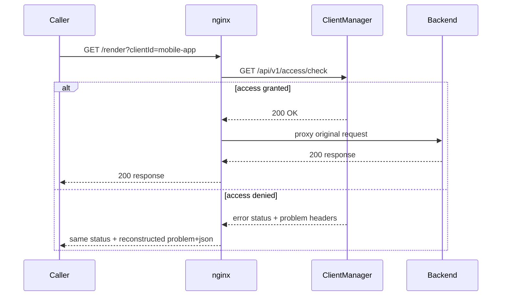

# Integration guide

This guide shows how to **plug ClientManager into your software** so every inbound request is evaluated before it reaches your backend. The worked example uses **nginx** `auth_request`, which issues a **GET** subrequest — matching ClientManager's access-check endpoint.

## What you are integrating

ClientManager sits beside your services and answers one gatekeeping question over HTTP:

| Question | Endpoint | Success | Typical denials |
| --- | --- | --- | --- |
| May this client use this service? | `GET /api/v1/access/check` | `200` | `400`, `401`, `403`, `404`, `429`, `503` |

The endpoint accepts parameters as **query strings** (not a JSON body), so reverse proxies and `auth_request` can call it without custom scripting.

### Query parameters

| Endpoint | Parameters | Example |
| --- | --- | --- |
| Access check | `clientId`, `serviceId` | `/api/v1/access/check?clientId=mobile-app&serviceId=pdf-render` |

On success:

```json
{
  "clientId": "mobile-app",
  "serviceId": "pdf-render",
  "remainingRequests": 37
}
```

On failure, the API returns `application/problem+json`:

```json
{
  "title": "Too Many Requests",
  "status": 429,
  "detail": "Rate limit exceeded",
  "traceId": "00-abc123..."
}
```

The same fields are echoed as **response headers**:

| Header | nginx variable (after `auth_request`) | Value |
| --- | --- | --- |
| `X-Problem-Title` | `$upstream_http_x_problem_title` | Problem title |
| `X-Problem-Detail` | `$upstream_http_x_problem_detail` | Problem detail |
| `X-Trace-Id` | `$upstream_http_x_trace_id` | Request trace id |
| `X-Problem-Json` | `$upstream_http_x_problem_json` | Full compact JSON body |

Rate-limited responses also include `Retry-After` when computable (`$upstream_http_retry_after` in nginx).

!!! tip "Deny by default"
    A client must have an explicit `isAllowed: true` entry for a service. Missing configuration is `401 Unauthorized`; disabled clients, disabled services, or disallowed relationships are `403 Forbidden`.

!!! note "Removed: resource pools"
    `GET /api/v1/resources/acquire` and `GET /api/v1/resources/release` were removed in the lean refactor. Concurrency caps via resource pools are no longer supported — use rate limits only.

## End-to-end flow



The access check **increments rate-limit counters** and records RPM. Treat it as “this request is about to be served”, not a free cacheable peek.

## Identifying the client

ClientManager does not guess who is calling. **Your edge layer must supply `clientId`** (and `serviceId` for access checks).

Common patterns:

| Source | Example | Good for |
| --- | --- | --- |
| Query parameter | `?clientId=mobile-app` | Demos, simple integrations |
| Header | `X-Client-Id: mobile-app` | Server-to-server behind a trusted proxy |
| JWT / API key mapping | Map `sub` or key id → `clientId` | Production |

In production, prefer headers or signed tokens so callers cannot impersonate another client by editing the query string.

### Mapping routes to `serviceId`

Register each protected backend capability as a **service** in ClientManager. Your proxy must send the service id for the upstream you are about to call:

```nginx
set $cm_service_id "pdf-render";
```

## nginx: native `auth_request`

`auth_request` issues a **GET** subrequest to an internal location that proxies to ClientManager with `clientId` and `serviceId` as query parameters.

!!! important "Auth subrequests discard the body"
    `auth_request` only preserves **status and headers**. ClientManager echoes problem fields in `X-Problem-*` headers so nginx can reconstruct the denial.

### 1. Shared pieces (`server` block)

```nginx
http {
    map $http_x_client_id $cm_client_id {
        default $http_x_client_id;
        ""      $arg_clientId;
    }

    server {
        listen 443 ssl;
        server_name api.example.com;

        location = /_cm_check {
            internal;
            proxy_pass_request_body off;
            proxy_set_header Content-Length "";
            proxy_pass https://clientmanager.apps.example.com/api/v1/access/check?clientId=$cm_client_id&serviceId=$cm_service_id;
            proxy_ssl_server_name on;
        }

        location @clientmanager_error {
            internal;
            default_type application/problem+json;

            if ($cm_retry != "") {
                add_header Retry-After $cm_retry always;
            }

            if ($cm_status = 400) { return 400 $cm_json; }
            if ($cm_status = 401) { return 401 $cm_json; }
            if ($cm_status = 403) { return 403 $cm_json; }
            if ($cm_status = 404) { return 404 $cm_json; }
            if ($cm_status = 429) { return 429 $cm_json; }
            if ($cm_status = 500) { return 500 $cm_json; }
            if ($cm_status = 502) { return 502 $cm_json; }
            if ($cm_status = 503) { return 503 $cm_json; }
            if ($cm_status = 504) { return 504 $cm_json; }

            return 502 $cm_json;
        }
    }
}
```

### 2. Protected location

```nginx
location /render {
    set $cm_service_id pdf-render;

    auth_request /_cm_check;
    auth_request_set $cm_status $upstream_status;
    auth_request_set $cm_json   $upstream_http_x_problem_json;
    auth_request_set $cm_retry  $upstream_http_retry_after;
    error_page 400 401 403 404 429 500 502 503 504 = @clientmanager_error;

    proxy_pass http://pdf-renderer:8080;
}
```

### 3. Try it

```bash
curl -i "https://api.example.com/render?clientId=mobile-app"
curl -i "https://api.example.com/render?clientId=unknown-tenant"
```

## Calling the API directly

```bash
curl -sS "http://localhost:5062/api/v1/access/check?clientId=mobile-app&serviceId=pdf-render"
```

### Application middleware example (ASP.NET)

```csharp
var clientId = context.Request.Headers["X-Client-Id"].FirstOrDefault();
var serviceId = "pdf-render";

var response = await httpClient.GetAsync(
    $"/api/v1/access/check?clientId={Uri.EscapeDataString(clientId)}&serviceId={Uri.EscapeDataString(serviceId)}",
    context.RequestAborted);

if (!response.IsSuccessStatusCode)
{
    context.Response.StatusCode = (int)response.StatusCode;
    context.Response.ContentType = "application/problem+json";
    await response.Content.CopyToAsync(context.Response.Body, context.RequestAborted);
    return;
}

await next(context);
```

## HTTP status reference

| Status | Meaning | Typical cause |
| --- | --- | --- |
| `200` | Allowed | Request passed all gates |
| `400` | Bad request | Unknown `clientId` |
| `401` | Unauthorized | No access configuration for this client–service pair |
| `403` | Forbidden | Client disabled, service disabled, or `isAllowed: false` |
| `404` | Not found | Unknown `serviceId` |
| `429` | Too many requests | Client or global service rate limit exceeded |
| `503` | Service unavailable | Storage backend unreachable |

Always log ClientManager's `traceId` from error bodies or `X-Trace-Id` when opening incidents.

## Integration checklist

1. **Register services** in ClientManager that mirror the capabilities you protect.
2. **Create a client configuration** per tenant with explicit `isAllowed` entries and optional rate limits.
3. **Choose a stable `clientId` source** (header or token mapping in production).
4. **Call `GET /api/v1/access/check`** before backend work (nginx `auth_request`, middleware, or API gateway).
5. **Forward non-`200` responses** — status, `problem+json` body, and `Retry-After` when present.
6. **Monitor** via Prometheus (`/prometheus/otel`) — do not poll access checks for monitoring.

## Related reading

- [Domain model](core/domain-model.md) — clients, services, and rate-limit configuration
- [Request flow](core/request-flow.md) — access check pipeline
- [Metrics integration guide](metrics-integration-guide.md) — Prometheus and Grafana
- [Persistence overview](persistence/index.md) — MongoDB/Redis for multi-instance deployments
