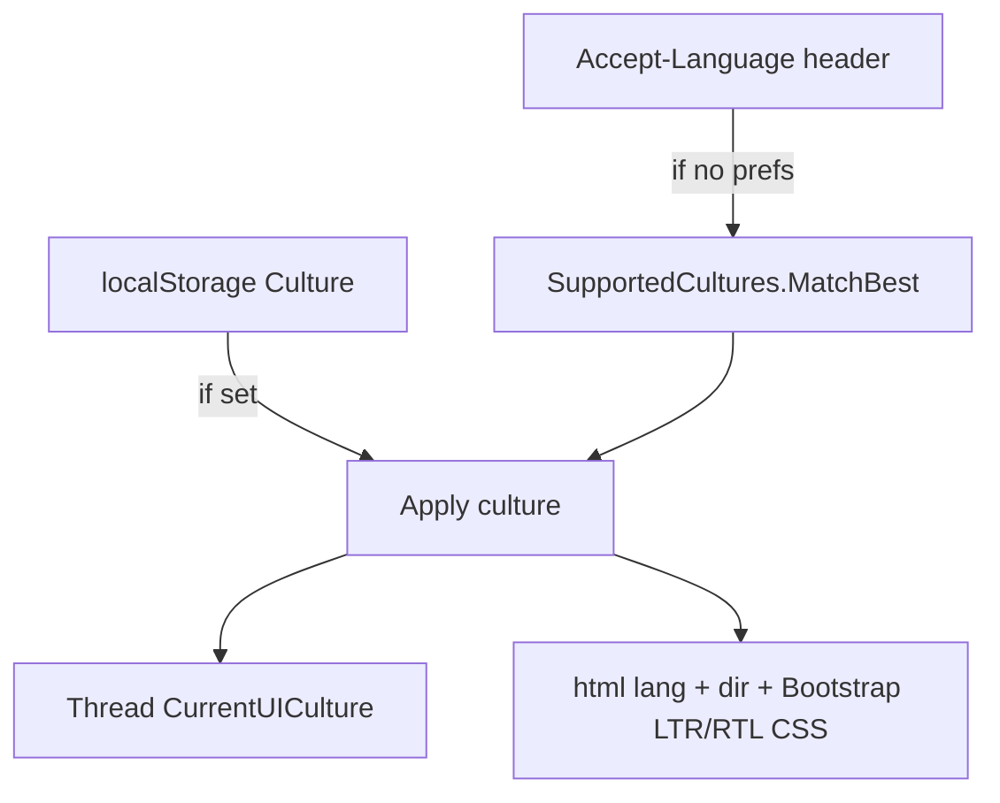

# Localization (Admin UI)

The Admin UI is localized with **.NET resource files** (`.resx`) and `IStringLocalizer<SharedResources>`. English is the default; Hebrew (`he-IL`) is the first additional culture. The API itself is **not** localized — only operator-facing Blazor UI strings.

**Source of truth:** edit the `.resx` files directly in Visual Studio or Rider. Do not maintain parallel JSON or codegen scripts for strings.

## Where strings live

| File | Role |
| --- | --- |
| `ClientManager.AdminUI/Resources/SharedResources.resx` | Default (English) strings — embedded next to the marker class |
| `ClientManager.AdminUI/Resources/SharedResources.he-IL.resx` | Hebrew satellite file — same keys as English |
| `ClientManager.AdminUI/Resources/SharedResources.cs` | Marker class for `IStringLocalizer<SharedResources>` |

`Program.cs` calls `AddLocalization()` without `ResourcesPath` so the embedded `.resx` files resolve from the `SharedResources` type namespace. Edit the `.resx` files in place; do not rename them to a codegen path.

Key naming follows a dotted hierarchy, for example:

- `Nav.Dashboard` — sidebar labels
- `Pages.Clients.Title` — page headings
- `Columns.Actions` — shared table headers
- `Terms.Denied.Throttled` — canonical denial terminology
- `Errors.ServiceUnavailable` — API problem codes mapped in `ApiErrorLocalizer`
- `LanguageOption.en` / `LanguageOption.he-IL` — labels shown in **Settings → Language**

## How culture is chosen

Resolution order:

1. **Saved preference** — `UserPreferences.Culture` in browser `localStorage` (`cm-preferences`)
2. **Browser default** — `Accept-Language` header, matched on the server in `CultureBoot.razor` via `SupportedCultures.MatchBest()`
3. **Fallback** — `en`



Changing language in **Settings** saves the preference, writes the ASP.NET Core culture cookie (`.AspNetCore.Culture`), and triggers a **full page reload** so the server renders every component in the new culture.

Culture preference lives in browser `localStorage` under the key `culture` (camelCase, matching Blazor JS interop). The server cannot read `localStorage` on the initial request, so `preferences.js` mirrors the preference into a `cm-culture` cookie that `CmCultureCookieProvider` reads before each HTTP request.

Changing language in **Settings** saves the preference, writes both `cm-culture` and `.AspNetCore.Culture` cookies, and triggers a **full page reload**. `MainLayout` also re-renders once if culture is applied from `localStorage` after the first paint (Blazor Server circuit).

## Supported cultures registry

`ClientManager.AdminUI/Localization/SupportedCultures.cs` is the single list of culture codes:

```csharp
public static readonly IReadOnlyList<string> Codes = ["en", "he-IL"];
```

Use this registry everywhere culture lists are needed (Settings dropdown, validation, RTL lookup). Do not hard-code culture codes in Razor pages.

| Helper | Purpose |
| --- | --- |
| `Normalize(culture)` | Map unknown input to a supported code or `en` |
| `MatchBest(candidates)` | Pick best match from `Accept-Language` tokens |
| `IsRtl(culture)` | `CultureInfo.TextInfo.IsRightToLeft` |
| `ParseAcceptLanguage(header)` | Split `Accept-Language` into candidate codes |

## Using strings in components

`IStringLocalizer<SharedResources>` is injected globally as `L` in `Components/_Imports.razor`:

```razor
<h1>@L["Pages.Clients.Title"]</h1>
<p>@L["Api.UnableToLoadData", errorMessage]</p>
```

For C# code, inject or pass `IStringLocalizer<SharedResources>` and use the same keys.

## API error messages

The API returns RFC 7807 problem responses with an `errorCode` field. The UI maps `Errors.{errorCode}` keys in `.resx` through `ApiErrorLocalizer`. When adding a new API error surface to the UI, add matching `Errors.*` keys in **every** culture file.

## RTL layout

Hebrew uses right-to-left layout:

- `preferences.js` sets `document.documentElement` `dir` and swaps Bootstrap between `bootstrap.min.css` and `bootstrap.rtl.min.css`
- Custom CSS under `wwwroot/css/` uses **logical** properties (`margin-inline-start`, `padding-inline-end`, etc.) instead of physical `left`/`right`

RTL is driven by `CultureInfo.IsRightToLeft`, not a hard-coded culture list.

## Development validation

On startup in **Development**, `LocalizationValidator` checks every culture in `SupportedCultures.Codes`:

- Probe key `Common.AppName` resolves
- Every `LanguageOption.{code}` exists for every culture

Missing keys throw immediately so incomplete satellite files are caught before manual testing.

## Adding or editing translations

### Change an existing string

1. Open `SharedResources.resx` (English) and find the key.
2. Edit the `<value>` in that file.
3. Open each satellite file (e.g. `SharedResources.he-IL.resx`) and update the **same key**.
4. Run the Admin UI — validation runs on startup in Development.

Keep `{0}`, `{1}`, … placeholders identical across cultures; only the surrounding text changes.

### Add a new UI string

1. Add a `<data name="Your.Key" xml:space="preserve">` entry to `SharedResources.resx` with the English text.
2. Copy the same `name` into every `SharedResources.{culture}.resx` with translated values.
3. Replace hard-coded text in Razor/C# with `L["Your.Key"]` (or `L["Your.Key", arg]`).
4. Build and run — missing satellite keys show as the English key name at runtime; dev validation catches missing probe/language-option keys only.

### Add a new language

1. Add the culture code to `SupportedCultures.Codes` (e.g. `"fr"` or `"fr-FR"`).
2. Create `Resources/SharedResources.{culture}.resx` with **all** keys from the English file.
3. Add `LanguageOption.{newCode}` to **every** `.resx` file (including English), so each culture can display every language name.
4. Audit RTL: if the culture is right-to-left, existing CSS should work via `IsRtl`; if not, no extra step.
5. Test via **Settings → Language** and verify dates/numbers format as expected.

## Hebrew terminology (`he-IL`)

Hebrew copy uses natural operator phrasing. Keep **מגבלת קצב** for rate
limits, **שיטה** for an algorithm/strategy label, and imperative wording for
action buttons. English resource keys remain unchanged; only
`SharedResources.he-IL.resx` values differ.

Dates and numbers respect `CultureInfo.CurrentCulture` where explicitly wired.
Invariant formatting is reserved for machine-readable values.

## Related code

| Piece | Location |
| --- | --- |
| Culture registry | `Localization/SupportedCultures.cs` |
| Startup validation | `Localization/LocalizationValidator.cs` |
| Thread + JS culture apply | `Services/CultureService.cs` |
| First-paint culture / Accept-Language | `Components/CultureBoot.razor` |
| Settings language picker | `Components/Pages/Settings.razor` |
| API error mapping | `Services/ApiErrorLocalizer.cs` |

## Related reading

- [Admin UI guide](admin-ui-guide.md) — screens and operator workflows
- [Development and operations](development-and-operations.md) — running the solution locally
