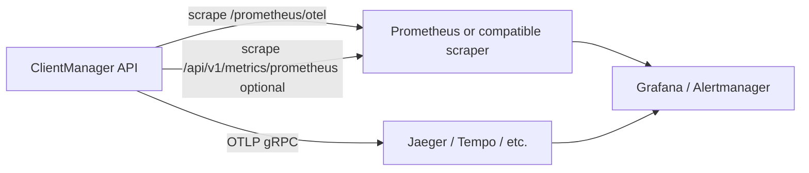

# Metrics integration guide

This guide shows how to plug ClientManager into an external metrics stack — **Prometheus**, **Grafana**, **Jaeger**, or any collector that speaks Prometheus scrape or OTLP.

ClientManager exposes two complementary metric surfaces plus distributed traces. Pick the scrape targets that match what you want to monitor.

## What you can monitor

| Signal | Source | Best for |
| --- | --- | --- |
| **Runtime / hot-path metrics** | `GET /prometheus/otel` | Request rate, latency, access denials, rate-limit outcomes, storage timings |
| **Usage / capacity gauges** | `GET /api/v1/metrics/prometheus` | Per-client/service granted & denied counts, pool slot utilization |
| **Traces** | OTLP export (`Observability:OtlpEndpoint`) | End-to-end request spans, storage sub-operations, denial reasons |
| **Operator dashboards** | `GET /api/v1/statistics/*` | Rich JSON for custom UIs — not a Prometheus scrape target |

The built-in Admin UI charts use the statistics API. External monitoring should prefer the Prometheus endpoints above.

## Architecture



## Quick start (local stack)

The fastest way to see metrics and traces working end-to-end:

1. Start the API (default `http://localhost:5062`).
2. Seed data and generate traffic so counters move:

   ```powershell
   python _scripts/seed_data.py --base-url http://localhost:5062
   python _scripts/traffic_generator.py --base-url http://localhost:5062 --interval 2.0
   ```

3. Launch the bundled observability stack:

   ```powershell
   python _scripts/launch_observability_ui.py
   ```

   | Service | URL |
   | --- | --- |
   | Grafana | http://localhost:3000 |
   | Prometheus | http://localhost:9090 |
   | Jaeger | http://localhost:16686 |

4. Confirm traces export: `appsettings.Development.json` sets `Observability:OtlpEndpoint` to `http://localhost:4317`. Override with environment variable `Observability__OtlpEndpoint` in other environments.

The launcher generates a Prometheus config that scrapes `/prometheus/otel` on the API host and provisions a starter Grafana dashboard.

## Prometheus scrape configuration

### Runtime metrics (recommended primary job)

Scrape OpenTelemetry metrics from the API process:

```yaml
scrape_configs:
  - job_name: clientmanager-runtime
    scrape_interval: 15s
    metrics_path: /prometheus/otel
    static_configs:
      - targets:
          - clientmanager-api:5062   # Docker service name or host:port
```

When the API runs on the host and Prometheus runs in Docker, use `host.docker.internal:5062` (Docker Desktop) or the host gateway IP instead of `localhost`.

### Usage and capacity gauges (optional second job)

For per-client/service rollups and pool slot gauges derived from usage snapshots:

```yaml
scrape_configs:
  - job_name: clientmanager-usage
    scrape_interval: 30s
    metrics_path: /api/v1/metrics/prometheus
    static_configs:
      - targets:
          - clientmanager-api:5062
```

!!! warning "Metric name overlap"
    Both exporters expose a metric named `clientmanager_requests_total`, but they mean different things:
    - **Runtime** (`/prometheus/otel`): cumulative HTTP-style counter from OpenTelemetry (dots in instrument names are normalized to underscores in exposition).
    - **Usage** (`/api/v1/metrics/prometheus`): gauge of latest bucket granted counts with `service` and `client` labels.

    Scrape them as **separate jobs** (as above). If you must combine them in one Prometheus, add `metric_relabel_configs` to prefix one job's metrics (for example `usage_`) before ingestion.

### Kubernetes (generic pattern)

Expose port `5062` on a `Service`, then add a `PodMonitor` or `ServiceMonitor` (Prometheus Operator) with `path: /prometheus/otel`. Restrict scrapes to your cluster network — the API has no built-in auth on metrics paths.

### Verify a scrape target

```bash
curl -sS http://localhost:5062/prometheus/otel | head
curl -sS http://localhost:5062/api/v1/metrics/prometheus | head
```

You should see `# HELP` / `# TYPE` lines in Prometheus text exposition format.

## Runtime metric catalog (`/prometheus/otel`)

These instruments are registered from `ClientManagerMetrics` and `StorageMetrics` plus ASP.NET Core instrumentation.

### HTTP layer

| Metric | Type | Tags | Description |
| --- | --- | --- | --- |
| `clientmanager_requests_total` | Counter | `method`, `endpoint`, `statusCode` | Every HTTP request |
| `clientmanager_requests_errors` | Counter | `method`, `endpoint`, `statusCode` | Responses with status ≥ 400 |
| `clientmanager_requests_duration` | Histogram | `method`, `endpoint` | End-to-end request time (ms) |

ASP.NET Core instrumentation also contributes standard `http.server.*` metrics.

### Access control

| Metric | Type | Tags | Description |
| --- | --- | --- | --- |
| `clientmanager_access_granted` | Counter | `clientId`, `serviceId` | Successful access checks |
| `clientmanager_access_denied` | Counter | `clientId`, `serviceId`, `reason` | Failed access checks |
| `clientmanager_storage_access_duration` | Histogram | (span context) | Storage-side access-check time (ms) |

**Access denial `reason` values:** `not_configured`, `client_disabled`, `service_disabled`, `not_allowed`, `global_rate_limited`, `rate_limited`.

### Rate limiting

| Metric | Type | Tags | Description |
| --- | --- | --- | --- |
| `clientmanager_ratelimit_allowed` | Counter | `clientId`, `serviceId` | Checks that passed |
| `clientmanager_ratelimit_denied` | Counter | `clientId`, `serviceId` | Checks that failed |
| `clientmanager_ratelimit_global_hits` | Counter | — | Global service limit denials |
| `clientmanager_storage_ratelimit_strategy_duration` | Histogram | — | Strategy evaluation time (ms) |

### Resource pools

| Metric | Type | Tags | Description |
| --- | --- | --- | --- |
| `clientmanager_resources_acquired` | Counter | `clientId`, `resourcePoolId` | Successful acquisitions |
| `clientmanager_resources_released` | Counter | `allocationId` | Explicit releases |
| `clientmanager_resources_denied` | Counter | `clientId`, `resourcePoolId`, `reason` | Failed acquisitions |
| `clientmanager_resources_expired` | Counter | — | Slots reclaimed by cleanup |
| `clientmanager_storage_resources_acquire_duration` | Histogram | — | Acquire path time (ms) |
| `clientmanager_storage_resources_release_duration` | Histogram | — | Release path time (ms) |

**Resource denial `reason` values:** `client_cap_reached`, `rate_limited`, `no_slots`.

### Storage backend

| Metric | Type | Description |
| --- | --- | --- |
| `clientmanager_storage_document_store_duration` | Histogram | Per-operation document store latency (ms) |

## Usage gauge catalog (`/api/v1/metrics/prometheus`)

These metrics are computed from usage snapshots and live allocation counters — useful for tenant dashboards and capacity planning.

| Metric | Type | Labels | Description |
| --- | --- | --- | --- |
| `clientmanager_requests_per_minute` | Gauge | — | Estimated global request rate |
| `clientmanager_requests_total` | Gauge | `service`, `client` | Latest bucket granted count |
| `clientmanager_denied_total` | Gauge | `service`, `client` | Latest bucket denied count |
| `clientmanager_pool_max_slots` | Gauge | `pool` | Configured pool capacity |
| `clientmanager_pool_active_slots` | Gauge | `pool` | Currently held slots |

Scrape interval can be looser than the runtime job (30–60s is typical) because values are bucket-based.

## Example PromQL queries

**HTTP error rate (5m):**

```promql
sum(rate(clientmanager_requests_errors_total[5m]))
  / sum(rate(clientmanager_requests_total[5m]))
```

**Access denials by reason:**

```promql
sum by (reason) (rate(clientmanager_access_denied_total[5m]))
```

**p95 access-check storage latency:**

```promql
histogram_quantile(
  0.95,
  sum(rate(clientmanager_storage_access_duration_bucket[5m])) by (le)
)
```

**Pool utilization:**

```promql
clientmanager_pool_active_slots / clientmanager_pool_max_slots
```

Adjust metric suffixes (`_total`, `_bucket`) to match your scrape output — OpenTelemetry's Prometheus exporter may append conventional suffixes.

## Example alerts

```yaml
groups:
  - name: clientmanager
    rules:
      - alert: ClientManagerHighDenialRate
        expr: sum(rate(clientmanager_access_denied_total[5m])) > 10
        for: 5m
        labels:
          severity: warning
        annotations:
          summary: Elevated access denials

      - alert: ClientManagerPoolSaturated
        expr: |
          clientmanager_pool_active_slots
            / clientmanager_pool_max_slots > 0.9
        for: 2m
        labels:
          severity: warning
        annotations:
          summary: Resource pool above 90% capacity

      - alert: ClientManagerHighLatency
        expr: |
          histogram_quantile(
            0.99,
            sum(rate(clientmanager_requests_duration_bucket[5m])) by (le)
          ) > 500
        for: 5m
        labels:
          severity: warning
        annotations:
          summary: p99 HTTP latency above 500ms
```

Tune thresholds for your traffic profile.

## Distributed traces (OTLP)

Traces are **not** scraped by Prometheus. Configure OTLP export on the API:

```json
{
  "Observability": {
    "OtlpEndpoint": "http://jaeger:4317"
  }
}
```

Environment variable equivalent: `Observability__OtlpEndpoint=http://jaeger:4317`.

When set, the API exports spans for:

- ASP.NET Core requests and outbound `HttpClient` calls
- Hot-path storage operations (`storage.access.check`, `storage.resource.acquire`, `storage.ratelimit.*`, …)

Search by service name **`ClientManager.Api`** in Jaeger, Grafana Tempo, or any OTLP-compatible backend.

Spans include tags such as `client.id`, `service.id`, `resource_pool.id`, and `denial.reason` — match these to `traceId` in API `problem+json` responses and NLog request logs.

## Grafana without the launcher script

1. Add a **Prometheus** datasource pointing at your Prometheus server.
2. Import or build panels from the runtime metric catalog above.
3. Optionally add a **Jaeger** or **Tempo** datasource for the OTLP trace backend.
4. For JSON-oriented tooling, `GET /api/v1/metrics/grafana` returns the same usage gauges in OpenMetrics-style JSON (useful for custom importers, not typical Grafana Prometheus panels).

## Security

ClientManager has **no authentication** on metrics or trace export endpoints today. Treat them like internal admin surfaces:

- Bind the API to a private network or cluster-internal `Service`.
- Terminate TLS at your ingress; scrape over mTLS or VPC-only routes.
- Do not expose `/prometheus/otel`, `/api/v1/metrics/*`, or OTLP ports on the public internet without a reverse-proxy auth layer.

## What not to use for monitoring

| Approach | Why avoid it |
| --- | --- |
| Polling `GET /api/v1/access/check` | Consumes rate-limit quota and records usage |
| Polling `GET /api/v1/resources/acquire` | Allocates real pool slots |
| Admin UI alone | No external alerting or long-term retention |

For read-only accessibility reports that do not consume quota, use `GET /api/v1/access/{clientId}` or the statistics API — see [Usage and observability](core/usage-and-observability.md).

## Multi-instance deployments

Each API instance exposes its own `/prometheus/otel` metrics. Prometheus aggregates across targets automatically when you list every replica in `static_configs` or use Kubernetes service discovery. Use `sum()` or `rate()` across the `instance` or `pod` label — scraping a single replica undercounts cluster traffic.

Example PromQL for HTTP requests (OTel):

```promql
sum(rate(http_server_request_duration_seconds_count{job="clientmanager-api"}[1m]))
```

Usage gauges on `/api/v1/metrics/prometheus` (including `clientmanager_requests_per_minute`) reflect cluster-wide usage when all instances share the `Statistics` storage role (MongoDB/Redis). Counts are written via atomic per-bucket counters with a brief (~1s) per-pod buffer lag. With isolated JsonFile per instance, usage gauges are not cluster-accurate.

## Related reading

- [Development and operations](development-and-operations.md) — scripts, Docker, troubleshooting
- [Configuration reference](configuration-reference.md) — `Observability:OtlpEndpoint` and environment overrides
- [API overview](api-overview.md) — full metrics and statistics endpoint list
- [Usage and observability](core/usage-and-observability.md) — how usage events become snapshots and Admin UI charts
- [Integration guide](integration-guide.md) — wire ClientManager in front of your services
