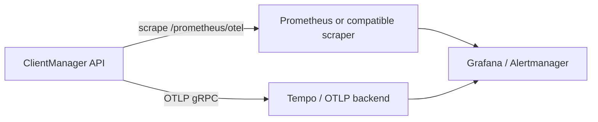

# Metrics integration guide

This guide shows how to plug ClientManager into an external metrics stack — **Prometheus**, **Grafana**, **Tempo**, or any collector that speaks Prometheus scrape or OTLP.

## What you can monitor

| Signal | Source | Best for |
| --- | --- | --- |
| **Runtime / hot-path metrics** | `GET /prometheus/otel` | Request rate, latency, access denials, rate-limit outcomes, storage timings |
| **Traces** | OTLP export (`Observability:OtlpEndpoint`) | End-to-end request spans, storage sub-operations, denial reasons |
| **Operator dashboard** | `GET /api/v1/statistics/overview` | Client/service counts and RPM — not a Prometheus scrape target |

The Admin UI dashboard shows RPM from the statistics API, not Prometheus.

## Architecture



## Quick start (local stack)

1. Start the API (default `http://localhost:5062`) or multipod compose.
2. Seed data and generate traffic:

   ```powershell
   python _scripts/seed_data.py --base-url http://localhost:5062
   python _scripts/traffic_generator.py --base-url http://localhost:5062 --interval 2.0
   ```

3. Launch the checked-in observability stack:

   ```powershell
   python _scripts/launch_observability_ui.py up
   python _scripts/launch_observability_ui.py up --traces   # optional Tempo
   ```

   | Service | URL |
   | --- | --- |
   | Grafana | http://localhost:3000/d/clientmanager-observability |
   | Prometheus | http://localhost:9090 |
   | Tempo (`--traces`) | http://localhost:3200 |

4. With traces: set `Observability:OtlpEndpoint` to `http://localhost:4317` (or use multipod compose which points at `otel-collector`).

See [Observability runbook](observability-runbook.md) and [Metrics catalog](metrics-catalog.md).

## Prometheus scrape configuration

Checked-in config: [`observability/prometheus/prometheus.yml`](../observability/prometheus/prometheus.yml)

```yaml
scrape_configs:
  - job_name: clientmanager-api
    scrape_interval: 5s
    metrics_path: /prometheus/otel
    static_configs:
      - targets:
          - api-1:5062
          - api-2:5062
          - api-3:5062
          - api:5062
          - host.docker.internal:5062
```

Unreachable targets stay `down` — normal when not running multipod.

### Kubernetes (generic pattern)

Expose port `5062` on a `Service`, then add a `PodMonitor` or `ServiceMonitor` with `path: /prometheus/otel`. Restrict scrapes to your cluster network — metrics paths have no built-in auth.

### Verify a scrape target

```bash
curl -sS http://localhost:5062/prometheus/otel | head
```

You should see `# HELP` / `# TYPE` lines in Prometheus text exposition format.

## Runtime metric catalog

Full reference: [Metrics catalog](metrics-catalog.md)

Import dashboard: [`observability/grafana/dashboards/clientmanager.json`](../observability/grafana/dashboards/clientmanager.json)

### HTTP layer (`ClientManagerMetrics`)

| Prometheus name | Labels | Description |
| --- | --- | --- |
| `clientmanager_http_requests_total` | `method`, `endpoint`, `statusCode` | Every HTTP request |
| `clientmanager_http_requests_errors_total` | `method`, `endpoint`, `statusCode` | Status ≥ 400 |
| `clientmanager_http_requests_duration_milliseconds_*` | `method`, `endpoint` | Request time (ms) |

### Access control

| Prometheus name | Labels | Description |
| --- | --- | --- |
| `clientmanager_requests_total` | `service`, `client`, `outcome` | Access-check outcomes |
| `clientmanager_access_denied_total` | `clientId`, `serviceId`, `reason` | Denied checks |
| `clientmanager_storage_access_duration_milliseconds_*` | `clientId`, `serviceId`, `result`, `reason` | Access-check latency |

## Example PromQL queries

**Granted RPM equivalent:**

```promql
sum(rate(clientmanager_requests_total{outcome="granted"}[5m])) * 60
```

**HTTP error rate (5m):**

```promql
sum(rate(clientmanager_http_requests_errors_total[5m]))
  / sum(rate(clientmanager_http_requests_total[5m]))
```

**Access denials by reason:**

```promql
sum by (reason) (rate(clientmanager_access_denied_total[5m]))
```

**p95 access-check storage latency:**

```promql
histogram_quantile(
  0.95,
  sum by (le) (rate(clientmanager_storage_access_duration_milliseconds_bucket[5m]))
)
```

Example alert rules: [`observability/prometheus/alerts.yml`](../observability/prometheus/alerts.yml)

## Distributed traces (OTLP)

Traces are **not** scraped by Prometheus. Configure OTLP export on the API:

```json
{
  "Observability": {
    "OtlpEndpoint": "http://localhost:4317"
  }
}
```

Environment variable: `Observability__OtlpEndpoint=http://localhost:4317`.

When set, the API exports spans for ASP.NET Core requests and hot-path storage operations.

With `--profile traces`, the **Traces** row at the bottom of the ClientManager dashboard lists recent `ClientManager.Api` spans — click a row for the waterfall. Explore → Tempo works too if you prefer.

Production: use 1–2% head sampling via OTel Collector; 7-day retention is typical. See [Observability runbook](observability-runbook.md).

## Security

ClientManager has **no authentication** on metrics or trace export endpoints. Treat them like internal admin surfaces:

- Bind the API to a private network or cluster-internal `Service`.
- Do not expose `/prometheus/otel` or OTLP ports on the public internet without a reverse-proxy auth layer.

## What not to use for monitoring

| Approach | Why avoid it |
| --- | --- |
| Polling `GET /api/v1/access/check` | Consumes rate-limit quota and records RPM |

For dashboard RPM without consuming quota, use `GET /api/v1/statistics/overview` or Prometheus.

## Multi-instance deployments

Each API instance exposes its own `/prometheus/otel` metrics. Prometheus aggregates across targets when you list every replica. Use `sum()` or `rate()` across the `instance` or `pod` label.

RPM in `statistics/overview` is cluster-accurate when all instances share the `Rpm` storage role (Redis or MongoDB).

## Related reading

- [Observability runbook](observability-runbook.md)
- [Metrics catalog](metrics-catalog.md)
- [Configuration reference](configuration-reference.md) — `Observability:OtlpEndpoint`, `Rpm`, `StorageReadCache`
- [API overview](api-overview.md) — statistics and metrics endpoints
- [Usage and observability](core/usage-and-observability.md) — RPM pipeline
- [Integration guide](integration-guide.md) — wire ClientManager in front of your services
