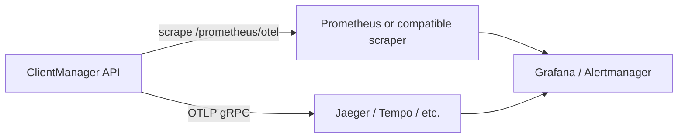

# Metrics integration guide

This guide shows how to plug ClientManager into an external metrics stack — **Prometheus**, **Grafana**, **Jaeger**, or any collector that speaks Prometheus scrape or OTLP.

## What you can monitor

| Signal | Source | Best for |
| --- | --- | --- |
| **Runtime / hot-path metrics** | `GET /prometheus/otel` | Request rate, latency, access denials, rate-limit outcomes, storage timings |
| **Traces** | OTLP export (`Observability:OtlpEndpoint`) | End-to-end request spans, storage sub-operations, denial reasons |
| **Operator dashboard** | `GET /api/v1/statistics/overview` | Client/service counts and RPM — not a Prometheus scrape target |

The Admin UI dashboard shows RPM from the statistics API, not Prometheus.

## Architecture



## Quick start (local stack)

1. Start the API (default `http://localhost:5062`).
2. Seed data and generate traffic:

   ```powershell
   python _scripts/seed_data.py --base-url http://localhost:5062
   python _scripts/traffic_generator.py --base-url http://localhost:5062 --interval 2.0
   ```

3. Launch the observability stack:

   ```powershell
   python _scripts/launch_observability_ui.py
   ```

   | Service | URL |
   | --- | --- |
   | Grafana | http://localhost:3000 |
   | Prometheus | http://localhost:9090 |
   | Jaeger | http://localhost:16686 |

4. Confirm traces: `Observability:OtlpEndpoint` in `appsettings.Development.json` defaults to `http://localhost:4317`.

## Prometheus scrape configuration

Scrape OpenTelemetry metrics from the API process:

```yaml
scrape_configs:
  - job_name: clientmanager-runtime
    scrape_interval: 15s
    metrics_path: /prometheus/otel
    static_configs:
      - targets:
          - clientmanager-api:5062
```

When the API runs on the host and Prometheus runs in Docker, use `host.docker.internal:5062` (Docker Desktop) or the host gateway IP.

### Kubernetes (generic pattern)

Expose port `5062` on a `Service`, then add a `PodMonitor` or `ServiceMonitor` with `path: /prometheus/otel`. Restrict scrapes to your cluster network — metrics paths have no built-in auth.

### Verify a scrape target

```bash
curl -sS http://localhost:5062/prometheus/otel | head
```

You should see `# HELP` / `# TYPE` lines in Prometheus text exposition format.

## Runtime metric catalog (`/prometheus/otel`)

Instruments from `ClientManagerMetrics` and `StorageMetrics` plus ASP.NET Core instrumentation.

### HTTP layer

| Metric | Type | Tags | Description |
| --- | --- | --- | --- |
| `clientmanager_requests_total` | Counter | `method`, `endpoint`, `statusCode` | Every HTTP request |
| `clientmanager_requests_errors` | Counter | `method`, `endpoint`, `statusCode` | Responses with status ≥ 400 |
| `clientmanager_requests_duration` | Histogram | `method`, `endpoint` | End-to-end request time (ms) |

ASP.NET Core instrumentation also contributes standard `http.server.*` metrics.

### Access control

| Metric | Type | Tags | Description |
| --- | --- | --- | --- |
| `clientmanager_access_granted` | Counter | `clientId`, `serviceId` | Successful access checks |
| `clientmanager_access_denied` | Counter | `clientId`, `serviceId`, `reason` | Failed access checks |
| `clientmanager_storage_access_duration` | Histogram | — | Storage-side access-check time (ms) |

**Access denial `reason` values:** `not_configured`, `client_disabled`, `service_disabled`, `not_allowed`, `global_rate_limited`, `rate_limited`.

### Rate limiting

| Metric | Type | Tags | Description |
| --- | --- | --- | --- |
| `clientmanager_ratelimit_allowed` | Counter | `clientId`, `serviceId` | Checks that passed |
| `clientmanager_ratelimit_denied` | Counter | `clientId`, `serviceId` | Checks that failed |
| `clientmanager_ratelimit_global_hits` | Counter | — | Global service limit denials |
| `clientmanager_storage_ratelimit_strategy_duration` | Histogram | — | Strategy evaluation time (ms) |

### Storage backend

| Metric | Type | Description |
| --- | --- | --- |
| `clientmanager_storage_document_store_duration` | Histogram | Per-operation document store latency (ms) |

Resource-pool metrics (`clientmanager_resources_*`, `clientmanager_pool_*`) are no longer emitted — those features were removed.

## Example PromQL queries

**Global RPM (matches Admin UI dashboard):**

```promql
sum(rate(clientmanager_requests_total[5m])) * 60
```

**HTTP error rate (5m):**

```promql
sum(rate(clientmanager_requests_errors_total[5m]))
  / sum(rate(clientmanager_requests_total[5m]))
```

**Access denials by reason:**

```promql
sum by (reason) (rate(clientmanager_access_denied_total[5m]))
```

**p95 access-check storage latency:**

```promql
histogram_quantile(
  0.95,
  sum(rate(clientmanager_storage_access_duration_bucket[5m])) by (le)
)
```

Adjust metric suffixes (`_total`, `_bucket`) to match your scrape output — OpenTelemetry's Prometheus exporter may append conventional suffixes.

## Example alerts

```yaml
groups:
  - name: clientmanager
    rules:
      - alert: ClientManagerHighDenialRate
        expr: sum(rate(clientmanager_access_denied_total[5m])) > 10
        for: 5m
        labels:
          severity: warning
        annotations:
          summary: Elevated access denials

      - alert: ClientManagerHighLatency
        expr: |
          histogram_quantile(
            0.99,
            sum(rate(clientmanager_requests_duration_bucket[5m])) by (le)
          ) > 500
        for: 5m
        labels:
          severity: warning
        annotations:
          summary: p99 HTTP latency above 500ms
```

## Distributed traces (OTLP)

Traces are **not** scraped by Prometheus. Configure OTLP export on the API:

```json
{
  "Observability": {
    "OtlpEndpoint": "http://jaeger:4317"
  }
}
```

Environment variable: `Observability__OtlpEndpoint=http://jaeger:4317`.

When set, the API exports spans for ASP.NET Core requests and hot-path storage operations (`storage.access.check`, `storage.ratelimit.*`, …).

Search by service name **`ClientManager.Api`** in Jaeger, Grafana Tempo, or any OTLP-compatible backend.

## Security

ClientManager has **no authentication** on metrics or trace export endpoints. Treat them like internal admin surfaces:

- Bind the API to a private network or cluster-internal `Service`.
- Do not expose `/prometheus/otel` or OTLP ports on the public internet without a reverse-proxy auth layer.

## What not to use for monitoring

| Approach | Why avoid it |
| --- | --- |
| Polling `GET /api/v1/access/check` | Consumes rate-limit quota and records RPM |

For dashboard RPM without consuming quota, use `GET /api/v1/statistics/overview` or Prometheus.

## Multi-instance deployments

Each API instance exposes its own `/prometheus/otel` metrics. Prometheus aggregates across targets when you list every replica. Use `sum()` or `rate()` across the `instance` or `pod` label.

RPM in `statistics/overview` is cluster-accurate when all instances share the `Rpm` storage role (Redis or MongoDB).

## Related reading

- [Development and operations](development-and-operations.md) — scripts, Docker, troubleshooting
- [Configuration reference](configuration-reference.md) — `Observability:OtlpEndpoint`, `Rpm`, `StorageReadCache`
- [API overview](api-overview.md) — statistics and metrics endpoints
- [Usage and observability](core/usage-and-observability.md) — RPM pipeline
- [Integration guide](integration-guide.md) — wire ClientManager in front of your services
