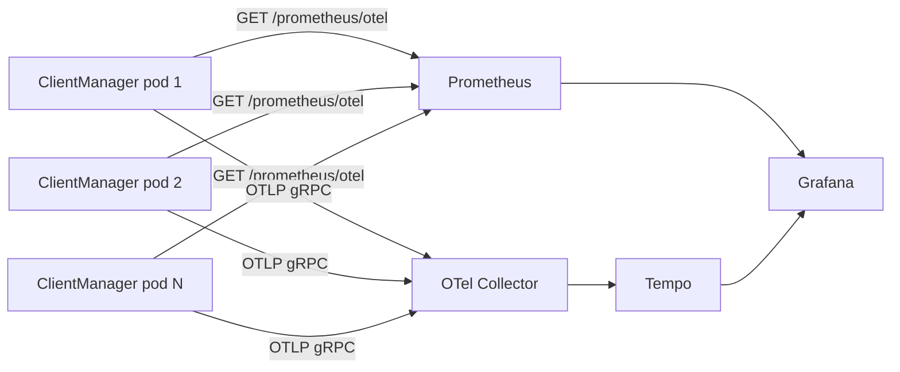

# On-prem observability stack

Deploy the checked-in **Prometheus + Grafana** stack on your infrastructure and point it at a **already-deployed** ClientManager API. Optional: add **Tempo + OTel Collector** for traces.

This guide assumes ClientManager is running elsewhere (Kubernetes, VMs, another compose stack). You deploy only the monitoring layer.

Assets: `compose/observability.yml`, `observability/`.

## Architecture



## Prerequisites

- Docker (or adapt configs to bare-metal Prometheus/Grafana installs)
- Network path from Prometheus to every ClientManager replica on port **5062** (or your mapped port)
- Network path from each API pod to the OTel Collector on **4317** (traces only)

## Step 1 — Copy observability files

Copy these paths to your deployment host or config repo:

| Path | Purpose |
| --- | --- |
| `compose/observability.yml` | Service definitions |
| `observability/prometheus/prometheus.yml` | Scrape config |
| `observability/prometheus/alerts.yml` | Alert rules |
| `observability/grafana/provisioning/` | Datasource + dashboard provisioning |
| `observability/grafana/dashboards/clientmanager.json` | Dashboard |
| `observability/otel-collector/config.yaml` | Trace pipeline (optional) |
| `observability/tempo/tempo.yaml` | Trace storage (optional) |

## Step 2 — Configure scrape targets

Edit `observability/prometheus/prometheus.yml`. Replace the checked-in Docker demo targets with your deployed endpoints.

**Static example** (three VMs):

```yaml
global:
  scrape_interval: 15s
  evaluation_interval: 15s

rule_files:
  - /etc/prometheus/alerts.yml

scrape_configs:
  - job_name: clientmanager-api
    metrics_path: /prometheus/otel
    scheme: https          # if TLS terminates at the API or ingress
    static_configs:
      - targets:
          - cm-api-01.internal:5062
          - cm-api-02.internal:5062
          - cm-api-03.internal:5062
```

Keep `job_name: clientmanager-api` — the dashboard filters on `job="clientmanager-api"`.

For Kubernetes, OpenShift, or file-based discovery, see [Pod discovery](pod-discovery.md).

### Scrape checklist

| Setup | Dashboard fidelity |
| --- | --- |
| Per-pod / discovery scrape (one target per replica) | Full — global and per-pod panels correct |
| Single sticky URL to one pod | Partial — ratios/latency OK; global volumes ~1/X |
| Round-robin single URL | **Invalid** — counter `rate()` will be wrong |

Restrict scrape traffic to an internal network. `/prometheus/otel` has **no built-in auth**.

## Step 3 — Start the metrics stack

From the repo root (or your copy):

```powershell
docker compose -f compose/observability.yml up -d
```

Verify:

```powershell
curl -sS http://localhost:9090/-/ready
curl -sS http://localhost:3000/api/health
```

Open Grafana: `http://<grafana-host>:3000/d/clientmanager-observability`

### Production hardening (compose defaults are dev-friendly)

The checked-in Grafana enables anonymous admin. For on-prem production, override in `compose/observability.yml` or your own deployment:

- Disable `GF_AUTH_ANONYMOUS_ENABLED`
- Configure LDAP/OAuth or local users
- Put Grafana and Prometheus behind your reverse proxy with TLS
- Tune retention: `--storage.tsdb.retention.time` (default in compose: **365d**)

## Step 4 — Point ClientManager at OTLP (optional traces)

Start the traces profile:

```powershell
docker compose -f compose/observability.yml --profile traces up -d
```

On **each** ClientManager replica, set:

```json
{
  "Observability": {
    "OtlpEndpoint": "http://<otel-collector-host>:4317"
  }
}
```

Environment variable: `Observability__OtlpEndpoint=http://<otel-collector-host>:4317`.

The checked-in collector uses **100% sampling** for local dev. For production, lower `sampling_percentage` in `observability/otel-collector/config.yaml` (1–2% is typical).

| Service | Port | Role |
| --- | --- | --- |
| OTel Collector | 4317 (gRPC), 4318 (HTTP) | Receives spans from API |
| Tempo | 3200 | Trace storage; embedded in dashboard **Traces** row |

## Step 5 — Verify end-to-end

### Metrics

```bash
# From the Prometheus host
curl -sS https://<clientmanager-host>/prometheus/otel | head
```

Prometheus → **Status → Targets**: all `clientmanager-api` targets **UP**.

Generate traffic against ClientManager, then confirm panels move in Grafana (last 15 minutes).

### Traces

Send a few access checks, then open the dashboard **Traces** row (bottom). Click a row field (Duration, Start time, Name) to load the waterfall panel.

## Step 6 — Enable alerting

Checked-in rules: `observability/prometheus/alerts.yml`

| Alert | Condition |
| --- | --- |
| `ClientManagerApiDown` | All scrape targets down for 2m |
| `ClientManagerHighHttpErrorRate` | 5xx rate > 1% for 5m |
| `ClientManagerHighAccessDenialRate` | Denial rate > 25% for 5m |
| `ClientManagerHighHttpMedianLatency` | HTTP p50 > 500ms for 5m |

Wire Alertmanager in your Prometheus deployment, or copy the PromQL into your existing alerting system.

### Example PromQL (also useful in Grafana explore)

**Granted RPM:**

```promql
sum(rate(clientmanager_requests_total{job="clientmanager-api", outcome="granted"}[5m])) * 60
```

**HTTP error rate:**

```promql
sum(rate(clientmanager_http_requests_errors_total{job="clientmanager-api"}[5m]))
  / sum(rate(clientmanager_http_requests_total{job="clientmanager-api"}[5m]))
```

**p95 access-check storage latency:**

```promql
histogram_quantile(
  0.95,
  sum by (le) (rate(clientmanager_storage_access_duration_milliseconds_bucket{job="clientmanager-api"}[5m]))
)
```

## Step 7 — Regenerate dashboard after upgrades

When you pull a new ClientManager version that changes metrics:

```powershell
python _scripts/build_observability_dashboard.py
```

Restart Grafana or re-copy `clientmanager.json` to your provisioning path.

## Related

- [Pod discovery](pod-discovery.md) — Kubernetes, OpenShift, Compose, VM examples
- [Existing Grafana & Prometheus](existing-monitoring.md) — when your org already runs monitoring
- [Metrics catalog](../metrics-catalog.md) — cardinality and label reference
